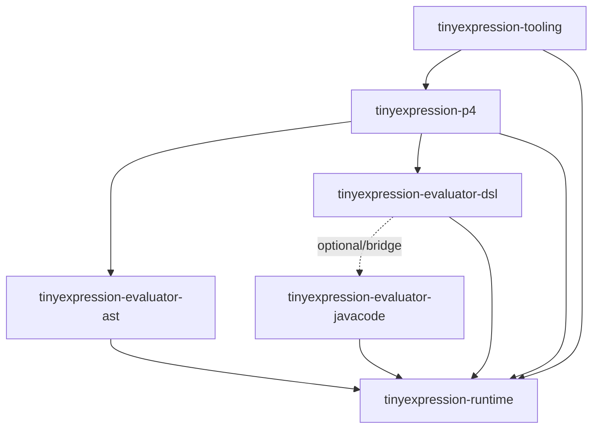

# TinyExpression Multi-Project Migration Plan

## 1. Background and Objective
TinyExpression has grown into a large project with **6 distinct execution backends**. To improve maintainability, facilitate Maven Central publishing, and clarify the internal dependency graph, we propose migrating from a monolithic JAR to a multi-module Maven project.

### The 6 Execution Backends to be Preserved:
1.  `JAVA_CODE` (Baseline JavaCode V3)
2.  `JAVA_CODE_LEGACY_ASTCREATOR` (Reference OOTC)
3.  `AST_EVALUATOR` (Generated AST Direct Execution)
4.  `DSL_JAVA_CODE` (Hybrid Native DSL Emitter + Legacy Bridge)
5.  `P4_AST_EVALUATOR` (UBNF-generated Parser + AST Execution)
6.  `P4_DSL_JAVA_CODE` (UBNF-generated Parser + DSL Java Execution)

---

## 2. Proposed Module Structure

| Module Name | Responsibilities | Target Backends |
| :--- | :--- | :--- |
| **`tinyexpression-parent`** | Parent POM, version management, common build plugins. | - |
| **`tinyexpression-runtime`** | Core interfaces (`Calculator`, `Source`), `ExecutionBackend` enum, `FormulaInfo`, common utilities, and registry. | All |
| **`tinyexpression-evaluator-ast`** | Logic for direct AST evaluation and token-to-AST transformation. | `AST_EVALUATOR` |
| **`tinyexpression-evaluator-javacode`** | Implementation of JavaCode V3 and legacy OOTC (V2). | `JAVA_CODE`, `JAVA_CODE_LEGACY_ASTCREATOR` |
| **`tinyexpression-evaluator-dsl`** | DSL-based Java emitter (Native + Bridge). | `DSL_JAVA_CODE` |
| **`tinyexpression-p4`** | UBNF-generated parser, type-safe AST models, and bridges to AST/DSL evaluators. | `P4_AST_EVALUATOR`, `P4_DSL_JAVA_CODE` |
| **`tinyexpression-tooling`** | LSP (Language Server), DAP (Debug Adapter), and CLI launchers. | - |

---

## 3. Dependency Graph (Concept)

---

## 4. Key Concerns and Risks

### A. Build Cycle and `unlaxer-dsl` Dependency
-   **Current State**: `tinyexpression` generates P4 code by calling `unlaxer-dsl` (physically located in a sibling directory) via shell scripts.
-   **Risk**: If `tinyexpression-p4` is a module, how should it handle code generation?
-   **Option 1**: Keep using the script, but ensure `unlaxer-dsl` is built first.
-   **Option 2**: Make `unlaxer-dsl` a Maven plugin or a build-time dependency to automate generation during the `generate-sources` phase.

### B. Parity Testing (Cross-Backend Validation)
-   **Current State**: `ThreeExecutionBackendParityTest` compares outputs across backends within the same JAR.
-   **Concern**: How to perform this test across modules?
-   **Solution**: Create a `tinyexpression-test-suite` module that depends on all evaluator modules to run integration/parity tests.

### C. Resource and UBNF Placement
-   **Concern**: Where should the source of truth for the UBNF grammar (`tinyexpression-p4-draft.ubnf`) reside?
-   **Proposal**: `tinyexpression-p4/src/main/resources/grammar/`.

---

## 5. Questions for the Architect

1.  **Granularity**: Should `evaluator-ast`, `evaluator-javacode`, and `evaluator-dsl` be separate modules, or is a single `tinyexpression-evaluators` module containing all three preferred?
2.  **Versioning**: Should all modules share the same version (e.g., `1.5.0`), or should they evolve independently? (Recommended: Shared version for initial release).
3.  **LSP/DAP Scope**: Should the VSCode extension (`tools/`) also be part of this multi-module structure, or remain a separate project that consumes the generated JARs?
4.  **Java 21 Preview**: Some modules use `--enable-preview`. This configuration must be carefully inherited from the Parent POM.

---

## 6. Next Steps
1.  Finalize the module list and dependency graph.
2.  Create the `tinyexpression-parent` POM.
3.  Phase 1: Extract `tinyexpression-runtime` and `tinyexpression-evaluator-ast`.
4.  Phase 2: Extract `tinyexpression-evaluator-javacode` and `dsl`.
5.  Phase 3: Reorganize `tinyexpression-p4` and its generator integration.
