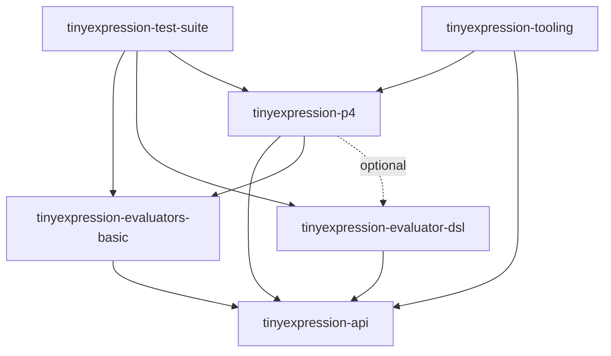

# TinyExpression Multi-Project Migration Plan (Detailed)

## 1. Background and Objective
TinyExpression has grown into a sophisticated engine with **6 distinct execution backends**. The current monolithic structure creates high cognitive load and circular dependency risks. This plan outlines a 3-layer architecture to decouple core definitions from specific evaluation strategies.

### The 6 Execution Backends to be Preserved:
1.  `JAVA_CODE` (Baseline JavaCode V3)
2.  `JAVA_CODE_LEGACY_ASTCREATOR` (Reference OOTC)
3.  `AST_EVALUATOR` (Generated AST Direct Execution)
4.  `DSL_JAVA_CODE` (Hybrid Native DSL Emitter + Legacy Bridge)
5.  `P4_AST_EVALUATOR` (UBNF-generated Parser + AST Execution)
6.  `P4_DSL_JAVA_CODE` (UBNF-generated Parser + DSL Java Execution)

---

## 2. The 3-Layer Architecture Strategy

To reduce cognitive load, modules are categorized into three layers based on their stability and responsibility.

### Layer 1: Core API & Metadata (`tinyexpression-api`)
- **Responsibility**: Pure definitions, interfaces, and metadata.
- **Key Symbols**: `Calculator`, `ExecutionBackend`, `FormulaInfo`, `Source`.
- **Constraint**: Must NOT depend on any implementation module.

### Layer 2: Evaluator Implementation (`tinyexpression-evaluators-*`)
- **Group A: `tinyexpression-evaluators-basic`**: Standard evaluators (JavaCode V3, Legacy, and direct AST).
- **Group B: `tinyexpression-evaluator-dsl`**: The high-performance hybrid Java emitter.
- **Strategy**: These modules implement the `Calculator` interface and register themselves via SPI.

### Layer 3: P4 & Tooling (`tinyexpression-p4`, `tinyexpression-tooling`)
- **P4 Engine**: Contains UBNF-generated code and bridges them to Layer 2 evaluators.
- **Tooling**: LSP, DAP, and CLI. These are "consumers" of the entire stack.

---

## 3. Decoupling Strategy: SPI (Service Provider Interface)

To avoid circular dependencies (e.g., Registry knowing implementations, and implementations using the Registry), we will adopt Java's `ServiceLoader`.

- **Registry**: `CalculatorCreatorRegistry` in `tinyexpression-api` will use `ServiceLoader` to find available `CalculatorCreator` implementations at runtime.
- **Providers**: Each evaluator module will provide a `META-INF/services/org.unlaxer.tinyexpression.runtime.CalculatorCreator` file.
- **Benefit**: New backends can be added by simply adding a JAR to the classpath, without modifying the core registry.

---

## 4. Proposed Module List

| Module Name | Layer | Target Backends |
| :--- | :--- | :--- |
| `tinyexpression-api` | Layer 1 | Core Interfaces, Enum, Registry (SPI-based) |
| `tinyexpression-evaluators-basic` | Layer 2 | `JAVA_CODE`, `JAVA_CODE_LEGACY_ASTCREATOR`, `AST_EVALUATOR` |
| `tinyexpression-evaluator-dsl` | Layer 2 | `DSL_JAVA_CODE` |
| `tinyexpression-p4` | Layer 3 | `P4_AST_EVALUATOR`, `P4_DSL_JAVA_CODE` |
| `tinyexpression-tooling` | Layer 3 | LSP, DAP, CLI |
| `tinyexpression-test-suite` | - | Cross-module Parity/Integration Tests |

---

## 5. Dependency Graph

---

## 6. Technical Challenges & Solutions

### A. Code Generation Lifecycle
- **Challenge**: `tinyexpression-p4` depends on code generated by `unlaxer-dsl`.
- **Solution**: Incorporate `unlaxer-dsl` as a build-time library. Use `maven-exec-plugin` within `tinyexpression-p4`'s `generate-sources` phase to automate UBNF-to-Java conversion.

### B. Cross-Backend Parity
- **Challenge**: Maintaining the `ThreeExecutionBackendParityTest` across modules.
- **Solution**: The `tinyexpression-test-suite` module will act as a "Full Stack" validator, ensuring all 6 backends produce identical results for the same formulas.

### C. Java 21 Preview Features
- **Solution**: Centralize `<compilerArgs><arg>--enable-preview</arg></compilerArgs>` in the Parent POM to ensure consistency across all modules.

---

## 7. Next Steps
1.  **Refactor `ExecutionBackend`**: Add SPI support to the enum/registry in the current codebase as a preparation.
2.  **Create Parent POM**: Define common versions and plugins.
3.  **Extract `tinyexpression-api`**: Move core interfaces and basic models.
4.  **Isolate Evaluators**: Move implementation logic into their respective modules.
5.  **Integrate P4 Generation**: Automate the UBNF build within the new Maven structure.
