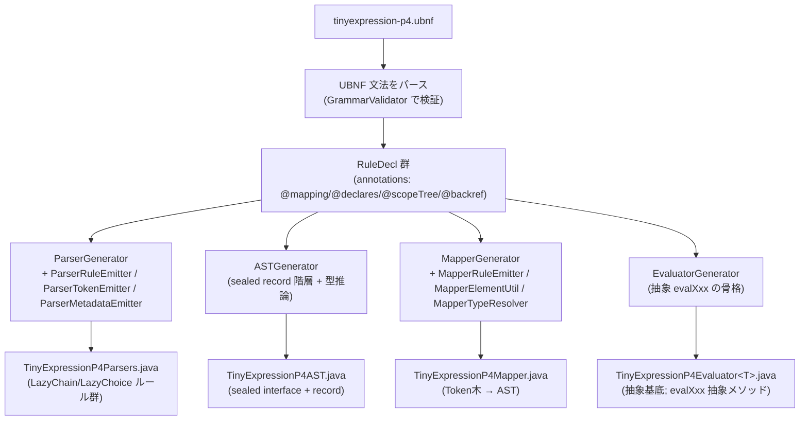
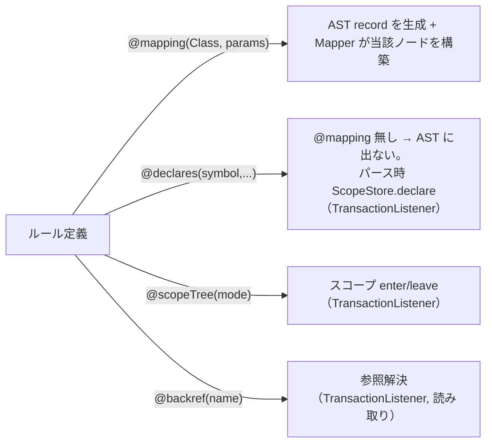
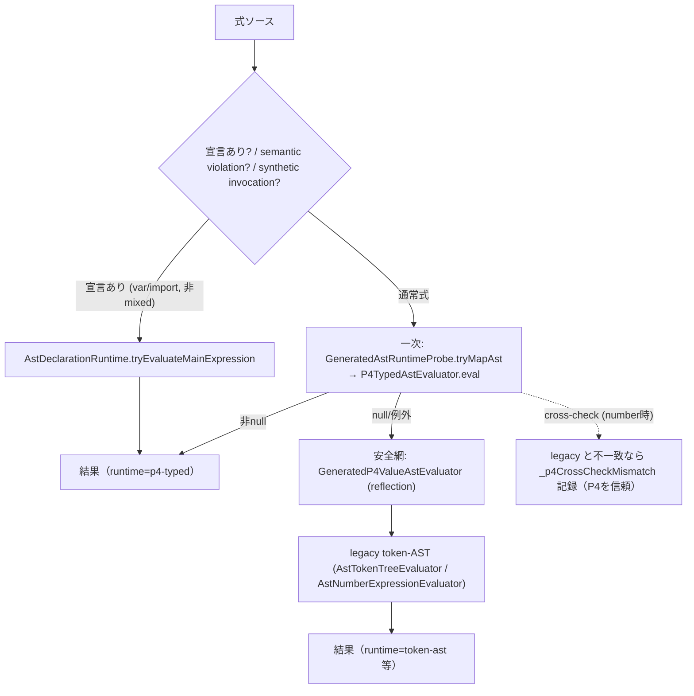
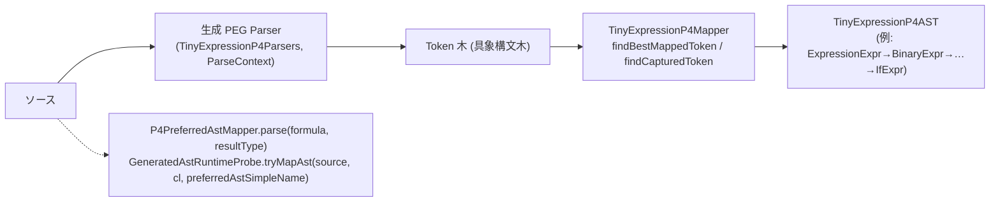
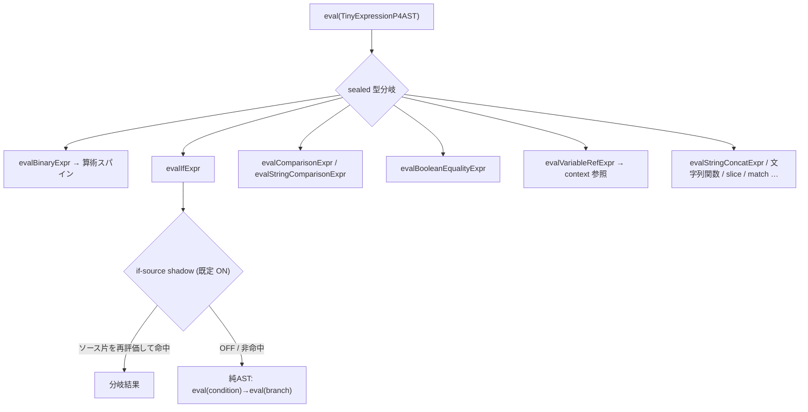
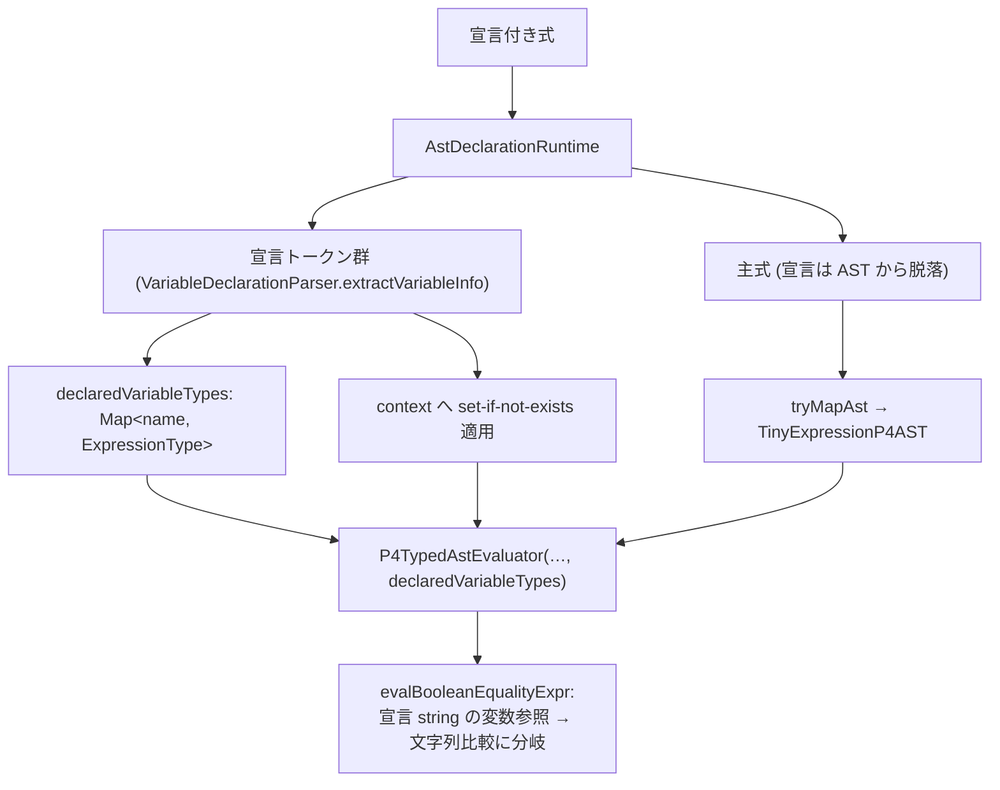

# tinyexpression P4 アーキテクチャ詳細（文法 → AST → 実行）

P4 バックエンドの全体像を 2 つのパイプラインに分けて図解する。

- **A. ビルド時（コード生成）**: DSL 文法 `.ubnf` → 生成された Parser / AST / Mapper / Evaluator（unlaxer-dsl の codegen）
- **B. 実行時（評価）**: 式ソース → パース → マッピング → 型付き AST → 評価 → 結果（fallback チェーン込み）

> 用語: 「P4」は generated-parser ベースの第4世代バックエンド。`P4TypedAstEvaluator` が一次評価器、それ以外（legacy token-AST / reflection / source 再パース）は安全網。

---

## 0. 全体俯瞰

```mermaid
flowchart LR
  subgraph BUILD["A. ビルド時 (unlaxer-dsl codegen, maven generate-sources)"]
    UBNF["tinyexpression-p4.ubnf<br/>(文法 + @mapping/@declares/@scopeTree/@backref)"]
    CG["CodegenMain<br/>--generators Parser,AST,Mapper,Evaluator"]
    GEN["生成ソース<br/>TinyExpressionP4Parsers / P4AST / P4Mapper / P4Evaluator"]
    UBNF --> CG --> GEN
  end
  subgraph RUN["B. 実行時 (評価)"]
    SRC["式ソース文字列"]
    PARSE["パース (生成 Parser, PEG)"]
    MAP["マッピング (生成 Mapper)"]
    AST["TinyExpressionP4AST<br/>(sealed records)"]
    EVAL["P4TypedAstEvaluator<br/>(evalXxx ディスパッチ)"]
    RES["結果値"]
    SRC --> PARSE --> MAP --> AST --> EVAL --> RES
  end
  GEN -. "生成物を実行時に使用" .-> PARSE
  GEN -. .-> MAP
  GEN -. .-> AST
  GEN -. .-> EVAL
```

---

## A. ビルド時 — DSL 文法 → 生成コード

### A-1. コード生成パイプライン

`pom.xml` の `exec-maven-plugin`（`generate-sources` フェーズ）が `org.unlaxer.dsl.CodegenMain` を起動:

```
CodegenMain --grammar tinyexpression-p4.ubnf --output target/generated-sources/... --generators Parser,AST,Mapper,Evaluator
```



| ジェネレータ | 生成物 | 役割 |
|---|---|---|
| `ParserGenerator` | `TinyExpressionP4Parsers` | 各ルールを `LazyChain`/`LazyChoice` サブクラスに。`@scopeTree`/`@declares`/`@backref` のルールは `TransactionListener` を実装し `ScopeStore` を呼ぶ |
| `ASTGenerator` | `TinyExpressionP4AST` | sealed interface + 各ルールの record（`IfExpr`/`BinaryExpr`/`BooleanEqualityExpr`/`VariableRefExpr` …）。透過 choice は `Object` 推論 |
| `MapperGenerator` | `TinyExpressionP4Mapper` | Token 木 → 型付き AST。`findBestMappedToken`/`findCapturedToken`（構造位置解決） |
| `EvaluatorGenerator` | `TinyExpressionP4Evaluator<T>` | sealed AST を網羅する抽象 `evalXxx(node)` の骨格（具象は手書き `P4TypedAstEvaluator`） |

### A-2. 文法注釈とマッピングの要点



- **`@mapping` だけが AST ノードになる**。`@declares`/`@scopeTree`/`@backref` は AST に現れず、パース時の副作用（scope/宣言/参照解決）として `TransactionListener` 経由で作用する。
- `MapperGenerator` の肝（#43/#32 で改善）:
  - **`findCapturedToken`**: キャプチャをルールの「直接の子」優先で解決（グローバル索引のずれを是正 = if 分岐/slice index）。
  - **透過 choice の `Object` 化**: `BooleanFactor ::= … | BooleanComparable @value` のような異種選択は `mapTransparentValue` で実ノードへ。
  - **assoc fold operand の widening**: `StringConcatExpr.left/right` 等が String でなく実 AST ノード（`Object`）になり、`eval(node)` で評価可能に。

> 詳細な codegen の不変条件・gotcha は unlaxer-parser 側の履歴（PR #46/#47/#48 = unlaxer-dsl 3.0.7/3.0.8/3.0.9）参照。

---

## B. 実行時 — ソース → AST → 実行

### B-1. 評価のオーケストレーション（fallback チェーン）

`AstEvaluatorCalculator.apply(context)` が司令塔。**P4TypedAstEvaluator が一次経路**、それ以外は安全網。



- `_p4FallbackReason` が立つのは安全網に落ちた時（理想は出ない）。
- **宣言（`var $x as ...; 主式`）** は一次 P4 経路をスキップし `AstDeclarationRuntime` 経由（後述 B-4）。

### B-2. パース → マッピング → 型付き AST



- パース性能の注意（#38/#40）: 曖昧括弧式は指数バックトラックしうる。**opt-in packrat メモ化**（unlaxer-parser #40）で緩和可能（`docs`: unlaxer-parser `packrat-memoization.md`）。
- マッパーは `@mapping` ルールのみを AST 化し、宣言（`@declares`）は落とす（B-4 の理由）。

### B-3. AST ノード → 実行（評価ディスパッチ）

`P4TypedAstEvaluator extends TinyExpressionP4Evaluator<Object>`。sealed AST を `eval(node)` が型で分岐し、各 `evalXxx` を呼ぶ。



- **if-source shadow**: `evalIfExpr` は既定で `tryEvaluateIfFromSource`（条件/分岐のソース片を再評価）を先に試す安全網。純AST経路の忠実度が上がるまでの保険。`-Dp4.disableIfSourceShadow` で計測時のみ無効化（#32 の if-off 計測）。
- 純AST忠実度は #32 codegen 修正 + 宣言型スレッディング（B-4）で達成済み（if-off 失敗 0）。実除去はパース性能（#40）待ち。

### B-4. 宣言（var / 型推論）の扱い — C

`var $name as string set if not exists 'opa' …; if($name == $remitter){1}else{0}`



- 宣言は `@declares` のみ（`@mapping` 無し）→ 生成 AST から脱落。よって**値**（set-if-not-exists）と**型**（`as string`）は別経路（`AstDeclarationRuntime`）で抽出し、`declaredVariableTypes` を評価器へスレッドする。
- 既定の `$a == $b` は `BooleanEqualityExpr` にマップされ boolean 比較になるが、宣言 string 変数が絡むと**文字列比較**へ分岐（legacy `VariableTypeResolver` と同等）。

---

## C. バックエンド一覧（参考）

| バックエンド | 経路 | 位置づけ |
|---|---|---|
| `P4_AST_EVALUATOR` | 生成 AST + `P4TypedAstEvaluator` | **一次** |
| `P4_DSL_JAVA_CODE` | 生成 AST → Java コード emit → コンパイル実行 | コード生成系 |
| legacy token-AST | `AstTokenTreeEvaluator` 等 | 安全網 / cross-check |
| reflection | `GeneratedP4ValueAstEvaluator` | 安全網 |

> 目標は **P4 fallback=0**（#32）。純AST経路を root から忠実化（#43/#32 codegen + 宣言型 C）し、最終的に if-source shadow を外す。残ゲートはパース性能（#38/#40 packrat）。

---

## 主要クラス早見

| 役割 | クラス |
|---|---|
| codegen 起動 | `org.unlaxer.dsl.CodegenMain` |
| 生成器 | `ParserGenerator` / `ASTGenerator` / `MapperGenerator` / `EvaluatorGenerator`（+ `*Emitter`, `MapperElementUtil`, `MapperTypeResolver`） |
| 生成物 | `TinyExpressionP4Parsers` / `TinyExpressionP4AST` / `TinyExpressionP4Mapper` / `TinyExpressionP4Evaluator` |
| 実行 司令塔 | `evaluator.ast.AstEvaluatorCalculator` |
| パース→AST | `p4.P4PreferredAstMapper` / `evaluator.ast.GeneratedAstRuntimeProbe` |
| 一次評価器 | `evaluator.ast.P4TypedAstEvaluator` |
| 宣言経路 | `evaluator.ast.AstDeclarationRuntime`（+ `parser.javalang.VariableDeclarationParser`, `evaluator.javacode.VariableTypeResolver`） |
| if/ternary/slice ソース安全網 | `p4.P4IfSourceSupport` / `P4TernarySourceSupport` / `P4SliceSourceSupport` |

関連 issue: #32（fallback=0）, #35（workaround 真っ当化）, #22（機能ギャップ）, #38（パース性能）, unlaxer-parser #40（packrat）。
