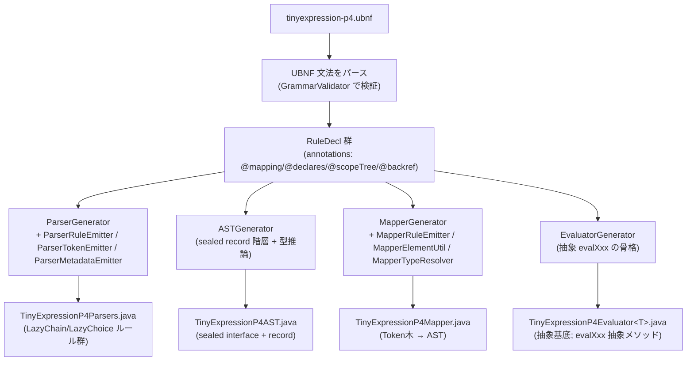
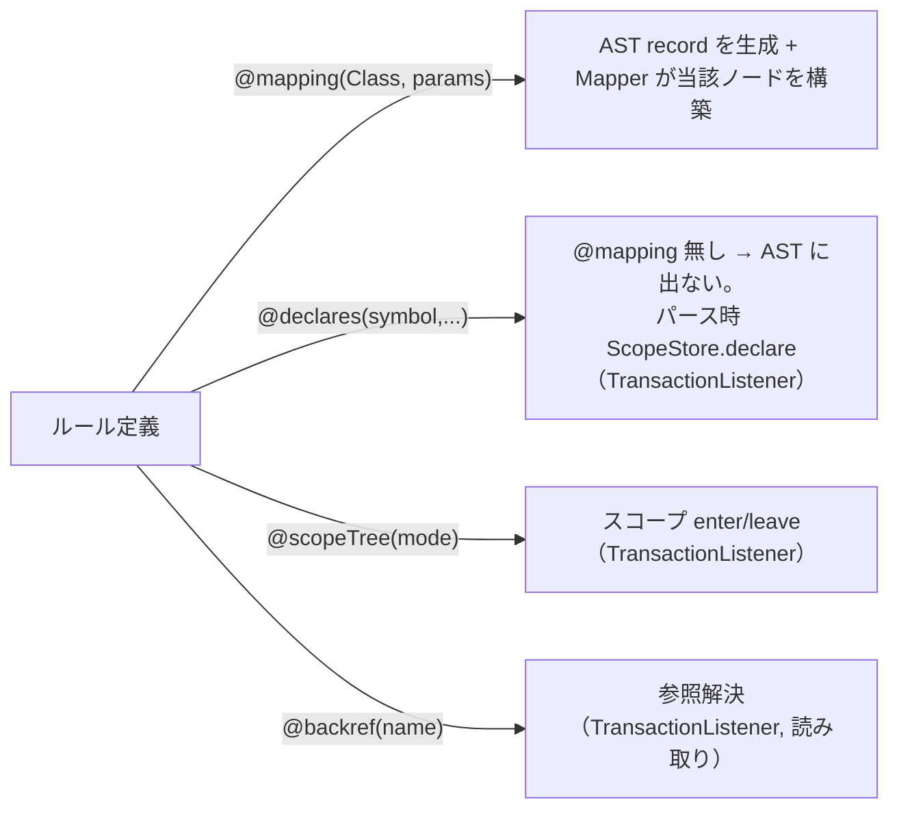
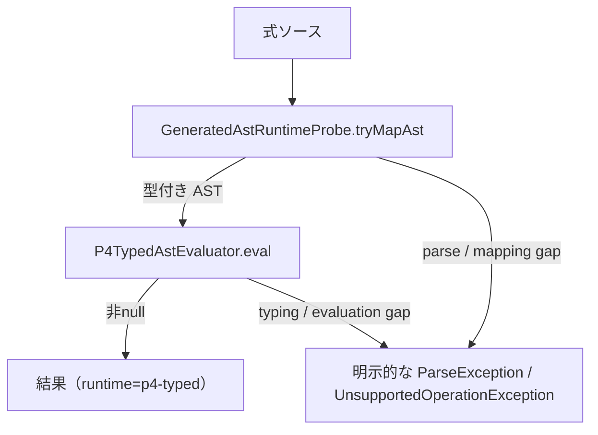
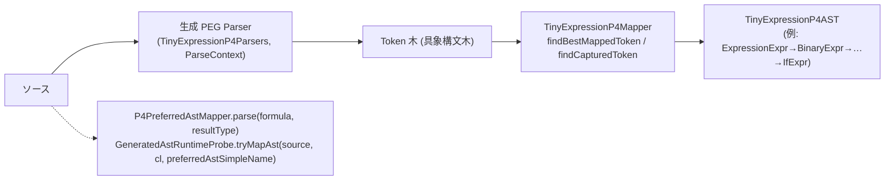
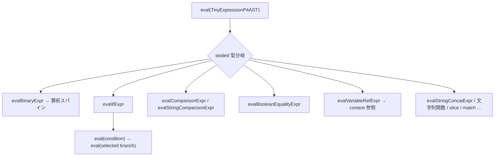
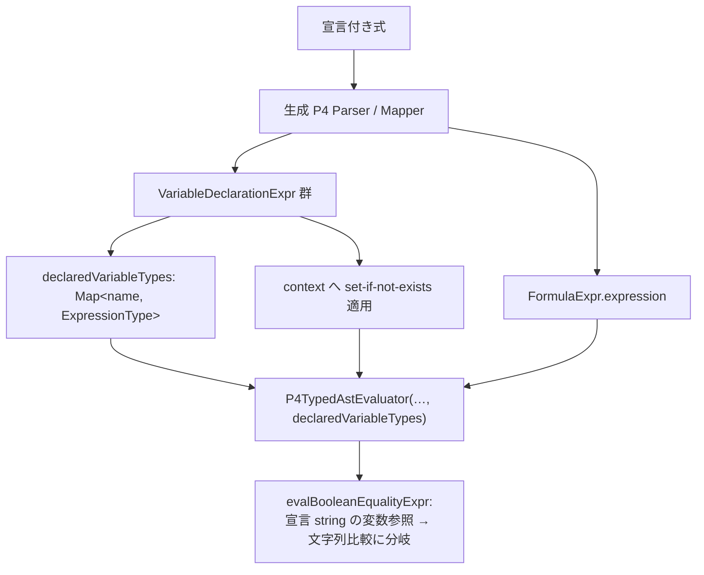

# tinyexpression P4 アーキテクチャ詳細（文法 → AST → 実行）

P4 バックエンドの全体像を 2 つのパイプラインに分けて図解する。

- **A. ビルド時（コード生成）**: DSL 文法 `.ubnf` → 生成された Parser / AST / Mapper / Evaluator（unlaxer-dsl の codegen）
- **B. 実行時（評価）**: 式ソース → パース → マッピング → 型付き AST → 評価 → 結果

> 現行契約では P4 系 backend は generated-only であり、legacy token-AST / reflection /
> JavaCode への実行時 fallback はない。未対応構文・型は明示的に失敗する。

---

## 0. 全体俯瞰

```mermaid
flowchart LR
  subgraph BUILD["A. ビルド時 (unlaxer-dsl codegen, maven generate-sources)"]
    UBNF["tinyexpression-p4.ubnf<br/>(文法 + @mapping/@declares/@scopeTree/@backref)"]
    CG["CodegenMain<br/>--generators Parser,AST,Mapper,Evaluator"]
    GEN["生成ソース<br/>TinyExpressionP4Parsers / P4AST / P4Mapper / P4Evaluator"]
    UBNF --> CG --> GEN
  end
  subgraph RUN["B. 実行時 (評価)"]
    SRC["式ソース文字列"]
    PARSE["パース (生成 Parser, PEG)"]
    MAP["マッピング (生成 Mapper)"]
    AST["TinyExpressionP4AST<br/>(sealed records)"]
    EVAL["P4TypedAstEvaluator<br/>(evalXxx ディスパッチ)"]
    RES["結果値"]
    SRC --> PARSE --> MAP --> AST --> EVAL --> RES
  end
  GEN -. "生成物を実行時に使用" .-> PARSE
  GEN -. .-> MAP
  GEN -. .-> AST
  GEN -. .-> EVAL
```

---

## A. ビルド時 — DSL 文法 → 生成コード

### A-1. コード生成パイプライン

`pom.xml` の `exec-maven-plugin`（`generate-sources` フェーズ）が `org.unlaxer.dsl.CodegenMain` を起動:

```
CodegenMain --grammar tinyexpression-p4.ubnf --output target/generated-sources/... --generators Parser,AST,Mapper,Evaluator
```



| ジェネレータ | 生成物 | 役割 |
|---|---|---|
| `ParserGenerator` | `TinyExpressionP4Parsers` | 各ルールを `LazyChain`/`LazyChoice` サブクラスに。`@scopeTree`/`@declares`/`@backref` のルールは `TransactionListener` を実装し `ScopeStore` を呼ぶ |
| `ASTGenerator` | `TinyExpressionP4AST` | sealed interface + 各ルールの record（`IfExpr`/`BinaryExpr`/`BooleanEqualityExpr`/`VariableRefExpr` …）。透過 choice は `Object` 推論 |
| `MapperGenerator` | `TinyExpressionP4Mapper` | Token 木 → 型付き AST。`findBestMappedToken`/`findCapturedToken`（構造位置解決） |
| `EvaluatorGenerator` | `TinyExpressionP4Evaluator<T>` | sealed AST を網羅する抽象 `evalXxx(node)` の骨格（具象は手書き `P4TypedAstEvaluator`） |

### A-2. 文法注釈とマッピングの要点



- **`@mapping` だけが AST ノードになる**。`@declares`/`@scopeTree`/`@backref` は AST に現れず、パース時の副作用（scope/宣言/参照解決）として `TransactionListener` 経由で作用する。
- `MapperGenerator` の肝（#43/#32 で改善）:
  - **`findCapturedToken`**: キャプチャをルールの「直接の子」優先で解決（グローバル索引のずれを是正 = if 分岐/slice index）。
  - **透過 choice の `Object` 化**: `BooleanFactor ::= … | BooleanComparable @value` のような異種選択は `mapTransparentValue` で実ノードへ。
  - **assoc fold operand の widening**: `StringConcatExpr.left/right` 等が String でなく実 AST ノード（`Object`）になり、`eval(node)` で評価可能に。

> 詳細な codegen の不変条件・gotcha は unlaxer-parser 側の履歴（PR #46/#47/#48 = unlaxer-dsl 3.0.7/3.0.8/3.0.9）参照。

---

## B. 実行時 — ソース → AST → 実行

### B-1. 評価のオーケストレーション

`AstEvaluatorCalculator.apply(context)` が司令塔。生成 P4 AST と
`P4TypedAstEvaluator` が唯一の実行経路となる。



- 失敗理由は `_p4FailureReason` で観測できる。
- 宣言・method・external 呼び出しも UBNF から生成された構造 AST として評価する。

### B-2. パース → マッピング → 型付き AST



- パース性能の注意（#38/#40）: 曖昧括弧式は指数バックトラックしうる。**opt-in packrat メモ化**（unlaxer-parser #40）で緩和可能（`docs`: unlaxer-parser `packrat-memoization.md`）。
- マッパーは `@mapping` ルールのみを AST 化し、宣言（`@declares`）は落とす（B-4 の理由）。

### B-3. AST ノード → 実行（評価ディスパッチ）

`P4TypedAstEvaluator extends TinyExpressionP4Evaluator<Object>`。sealed AST を `eval(node)` が型で分岐し、各 `evalXxx` を呼ぶ。



- `if` / ternary / `match` の分岐は UBNF の構造キャプチャを直接評価する。
- node 内部に残るソース断片解析の削減は #35 で継続するが、別 evaluator への実行時切り替えには使わない。

### B-4. 宣言（var / 型推論）の扱い — C

`var $name as string set if not exists 'opa' …; if($name == $remitter){1}else{0}`



- 宣言は `@mapping` された構造 AST として保持され、**値**（set-if-not-exists）と**型**（`as string`）を同じ P4 経路で解決する。
- 既定の `$a == $b` は `BooleanEqualityExpr` にマップされ boolean 比較になるが、宣言 string 変数が絡むと**文字列比較**へ分岐（legacy `VariableTypeResolver` と同等）。

---

## C. バックエンド一覧（参考）

| バックエンド | 経路 | 位置づけ |
|---|---|---|
| `AST_EVALUATOR` / `P4_AST_EVALUATOR` | 生成 AST + `P4TypedAstEvaluator` | generated-only |
| `DSL_JAVA_CODE` / `P4_DSL_JAVA_CODE` | 生成 AST → typed Java emit → コンパイル実行 | generated-only |
| `JAVA_CODE` | 手書き Java コード生成 | 明示選択する legacy backend |
| `JAVA_CODE_LEGACY_ASTCREATOR` | 旧 AST creator → Java コード生成 | frozen reference |

P4 系4 backend に実行時 fallback はない。legacy 実装が必要な利用者は backend を明示選択する。

---

## 主要クラス早見

| 役割 | クラス |
|---|---|
| codegen 起動 | `org.unlaxer.dsl.CodegenMain` |
| 生成器 | `ParserGenerator` / `ASTGenerator` / `MapperGenerator` / `EvaluatorGenerator`（+ `*Emitter`, `MapperElementUtil`, `MapperTypeResolver`） |
| 生成物 | `TinyExpressionP4Parsers` / `TinyExpressionP4AST` / `TinyExpressionP4Mapper` / `TinyExpressionP4Evaluator` |
| 実行 司令塔 | `evaluator.ast.AstEvaluatorCalculator` |
| パース→AST | `p4.P4PreferredAstMapper` / `evaluator.ast.GeneratedAstRuntimeProbe` |
| 型付き評価器 | `evaluator.ast.P4TypedAstEvaluator` |
| 型付き Java emitter | `evaluator.javacode.P4TypedJavaCodeEmitter` |
| 宣言・method・external 構造 | `TinyExpressionP4AST.FormulaExpr` 以下の生成 record |

関連 issue: #32（fallback=0）, #35（workaround 真っ当化）, #22（機能ギャップ）。
