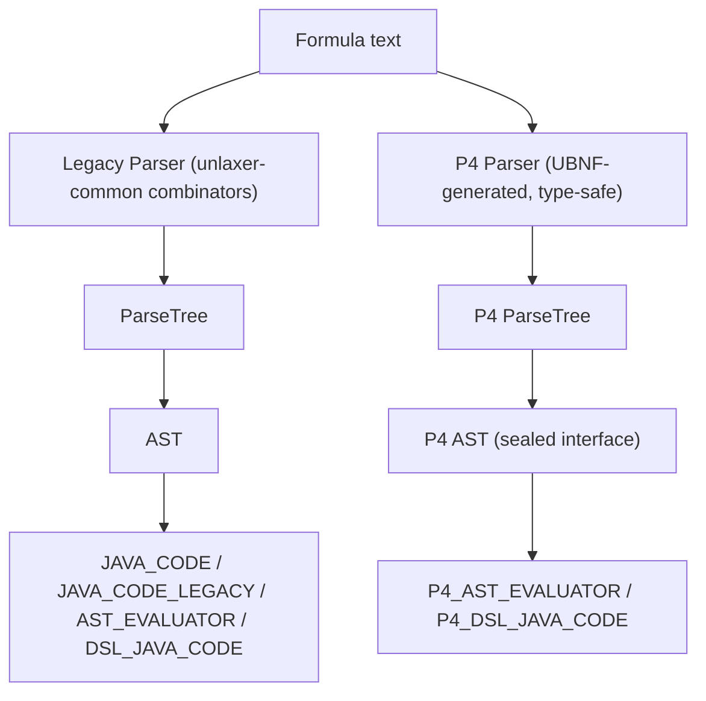
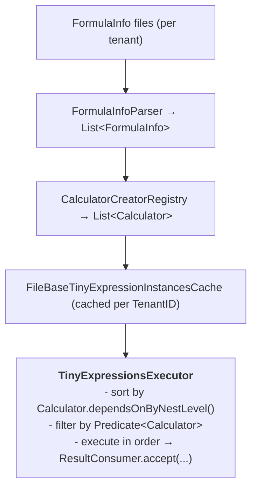
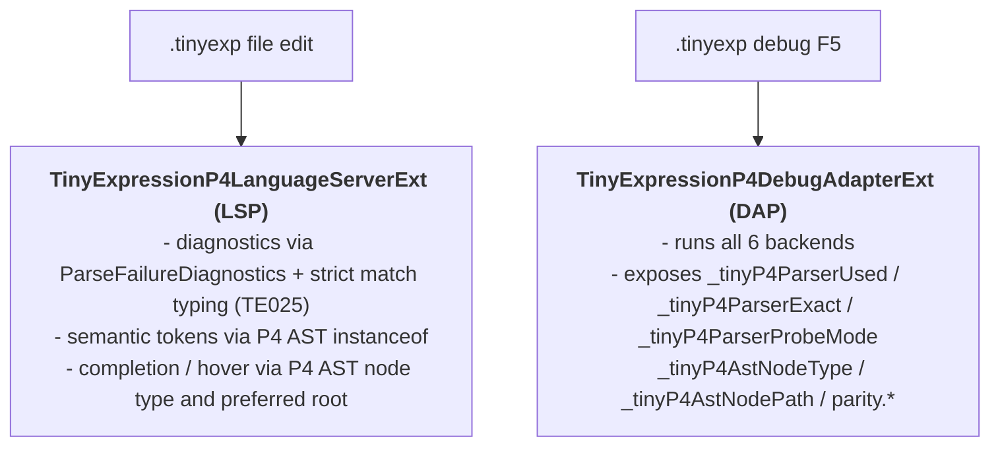

# TinyExpression Architecture

[日本語版](architecture-ja.md)

## Overview

TinyExpression is a **hybrid architecture** — a hand-written legacy parser stack coexists with an auto-generated P4 DSL parser stack. Both stacks feed into one of 6 execution backends.

Verified baseline as of 2026-04-24:

- `tinyexpression` `1.4.11`
- `unlaxer-common` `3.0.2`
- `unlaxer-dsl` `3.0.2`



---

## Parser Layer

### Legacy Parser (unlaxer-common)

The legacy parser is a hand-written **parser combinator** stack built on `unlaxer-common`.

Key interfaces:

| Interface / Class | Role |
|-------------------|------|
| `org.unlaxer.parser.Parser` | Root parser interface |
| `org.unlaxer.parser.combinator.BasicCombinator` | Combinator primitives (`seq`, `choice`, `zeroOrMore`, etc.) |
| `org.unlaxer.parser.AbstractParser` | Base class for concrete parsers |
| `org.unlaxer.tinyexpression.parser.*` | TinyExpression-specific parser implementations |

Parse results are `ParseTree` nodes (token trees). The legacy stack covers **all** language features.

### P4 Parser (UBNF-generated)

The P4 parser is generated from `tools/tinyexpression-p4-lsp-vscode/grammar/tinyexpression-p4.ubnf`,
with `docs/ubnf/tinyexpression-p4-complete.ubnf` kept as a snapshot, using `unlaxer-dsl 3.0.2`.

Generated artifacts:

| Artifact | Role |
|----------|------|
| `TinyExpressionP4Parsers` | Entry-point generated parser |
| P4 AST (sealed interface hierarchy) | Type-safe AST nodes |
| `TinyExpressionP4Mapper` | ParseTree → P4 AST mapper |
| `P4PreferredAstMapper` | hand-written facade for preferred-root selection and compat parse |
| `P4TypedAstEvaluator` | Type-safe AST evaluator (PRIMARY) |

The P4 stack provides type-safe `instanceof`-based dispatch — no regex fallback in LSP/DAP.
The current grammar covers CodeBlock, boolean equality, string dot methods, slice variants,
`isPresent(...)`, `inTimeRange(...)`, `inDayTimeRange(...)`, typed `if/ternary`, and strict `match` typing.

---

## AST Layer

The legacy stack uses `ASTCombinator` / `ASTNodeMapping` annotations to describe parse tree structure.

The P4 stack emits **sealed interface records**:

```java
sealed interface TinyExpressionNode permits IfExpr, MatchExpr, BinaryExpr, ... {}
record IfExpr(TinyExpressionNode condition, TinyExpressionNode then, TinyExpressionNode else_) implements TinyExpressionNode {}
```

This enables exhaustive `switch` expressions and eliminates runtime cast errors.

---

## 6 Execution Backends

| Backend | Class | Strategy |
|---------|-------|----------|
| `JAVA_CODE` | `JavaCodeCalculatorV3` | Parse → generate Java source → `javac` → load → invoke |
| `JAVA_CODE_LEGACY_ASTCREATOR` | `LegacyAstCreatorJavaCodeCalculator` | Same as above with pre-refactor AST creator (frozen) |
| `AST_EVALUATOR` | `AstEvaluatorCalculator` | Parse → AST → tree-walking interpreter; fallback chain: `generated-ast → token-ast → javacode` |
| `DSL_JAVA_CODE` | `DslJavaCodeCalculator` | Hybrid: native DSL Java emitter + legacy bridge fallback |
| `P4_AST_EVALUATOR` | `P4AstEvaluatorCalculator` | P4 parse → P4 AST → `P4TypedAstEvaluator` (PRIMARY) |
| `P4_DSL_JAVA_CODE` | `P4DslJavaCodeCalculator` | P4 parse → P4 AST → DSL Java emitter |

### Fallback Chain (AST_EVALUATOR)

```
P4TypedAstEvaluator (PRIMARY)
    │ fails (P4 grammar gap)
    ▼
GeneratedP4ValueAstEvaluator
    │ fails
    ▼
AstDeclarationRuntime / AstTokenTreeEvaluator (legacy AST walk)
    │ fails
    ▼
JavaCode fallback (JAVA_CODE path)
```

### Backend Registration

```
ExecutionBackend enum
    │
    ▼
CalculatorCreatorRegistry.forBackend(ExecutionBackend)
    │
    ▼
CalculatorCreator.create(FormulaInfo, ...)
    │
    ▼
concrete Calculator instance
```

---

## Type System

`ExpressionTypes` enum maps formula types to Java types:

```
_byte → _short → _int → _long → _float → _double
                                  ↑
                             number (alias)
```

Type promotion rules follow Java widening conversion. `SpecifiedExpressionTypes` carries both the formula evaluation type and the result type through the pipeline.

See [decisions/ADR-002-type-promotion.md](decisions/ADR-002-type-promotion.md) for the promotion rule rationale.

---

## In-Memory Compiler

The `JAVA_CODE` family backends use an in-memory Java compiler pipeline:

```
Java source string
    │
    ▼
javax.tools.JavaCompiler (in-process)
    │
    ▼
MemoryJavaFileManager → ByteArrayJavaFileObject
    │
    ▼
MemoryClassLoader → Class<Calculator>
    │
    ▼
Calculator.apply(CalculationContext)
```

Key classes:

- `org.unlaxer.compiler.MemoryClassLoader`
- `org.unlaxer.compiler.MemoryJavaFileManager`
- `org.unlaxer.compiler.CompileContext`

`CompileContext` also hardens dynamic `javac` classpath resolution so surefire and module-separated runs
can still resolve `CalculationContext` and `TokenBaseCalculator`.

---

## Multi-Formula Execution Pipeline



---

## LSP / DAP Integration

The P4 LSP server (`tools/tinyexpression-p4-lsp-vscode`) connects to the P4 stack:



External IDE repository: [tinyexpression-group/tinyexpression-ide](https://github.com/tinyexpression-group/tinyexpression-ide)

---

## Related Documents

- [backends.md](backends.md) — backend comparison table and fallback chain
- [language-guide.md](language-guide.md) — language specification
- [TINYEXPRESSION-P4-UPGRADE-FOLLOWUP-ISSUE-2026-04-24.md](TINYEXPRESSION-P4-UPGRADE-FOLLOWUP-ISSUE-2026-04-24.md) — remaining work after the latest UBNF upgrade
- [TINYEXPRESSION-UNLAXERDSL-HANDBOOK.md](TINYEXPRESSION-UNLAXERDSL-HANDBOOK.md) — operational guide for regeneration and verification
- [decisions/ADR-001-p4-primary.md](decisions/ADR-001-p4-primary.md) — P4 promotion rationale
- [decisions/ADR-002-type-promotion.md](decisions/ADR-002-type-promotion.md) — type promotion rules
- [decisions/ADR-003-java-codeblock-safety.md](decisions/ADR-003-java-codeblock-safety.md) — Java code block security model
