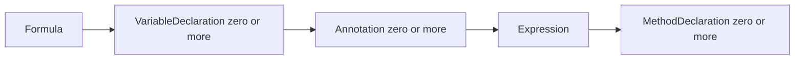
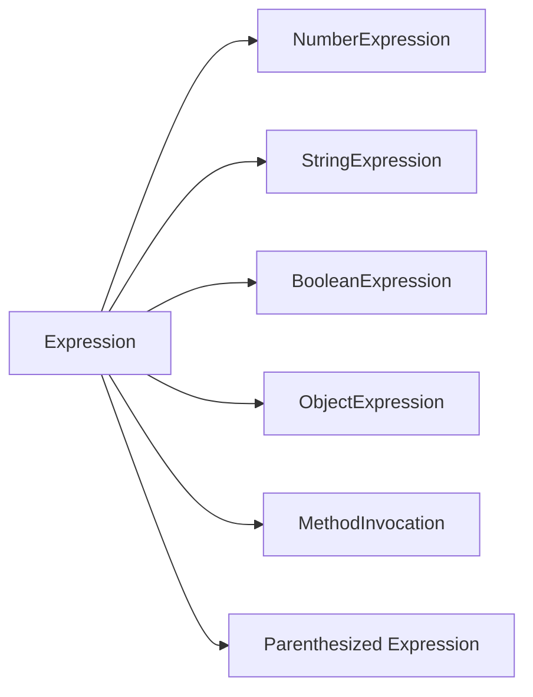
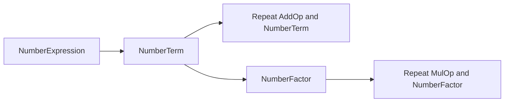
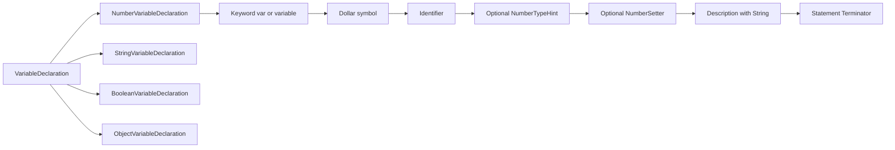
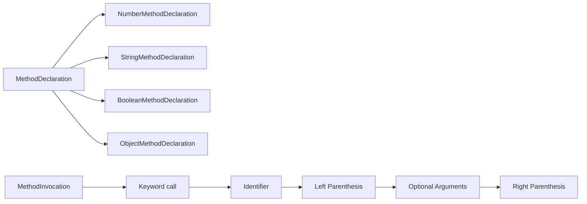
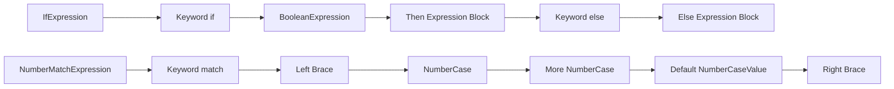

# TinyExpression P4 Grammar — Railroad Diagrams

**Complete, auto-generated railroad diagrams** for all grammar rules.

## 📖 Documentation

- **[Complete Railroad Diagrams](../railroad/README.md)** — All 106 grammar rules with SVG railroad diagrams (GitHub-compatible)
- [UBNF Grammar](../ubnf/tinyexpression-p4-complete.ubnf) — Complete grammar definition
- [BNF Reference](tinyexpression-p4-draft.bnf) — EBNF-style reference

## Quick Navigation

The diagrams below are simplified Mermaid flowcharts showing key rule relationships. For complete rule definitions and exact syntax, refer to the **[Complete Railroad Diagrams](../railroad/README.md)**.

## 1. Formula

## 2. Expression Choice

## 3. Number Expression (precedence)

## 4. Variable Declaration

## 5. Method Declaration + Invocation

## 6. If / Match

