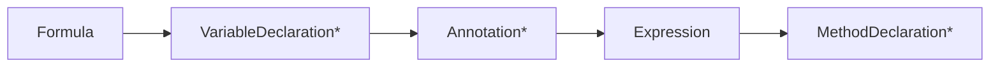
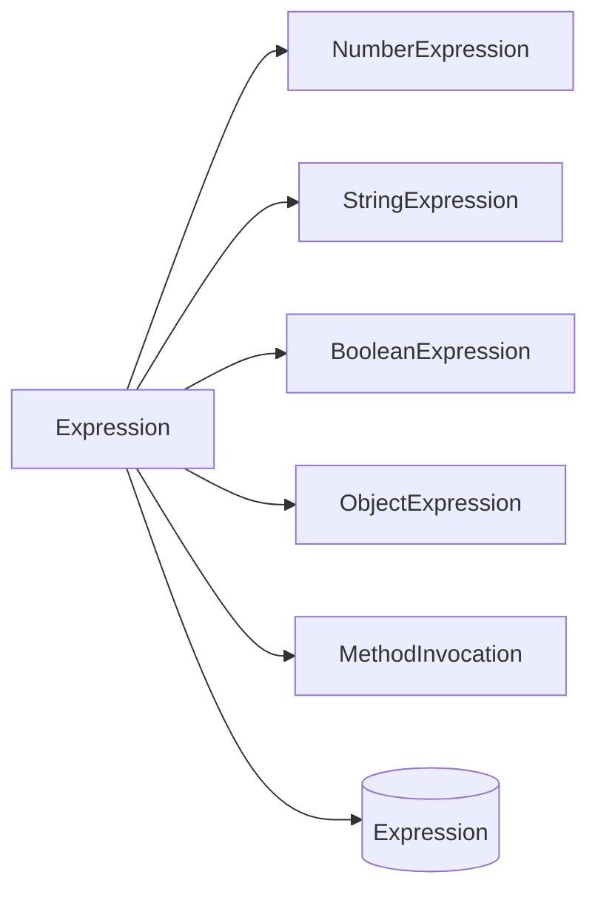
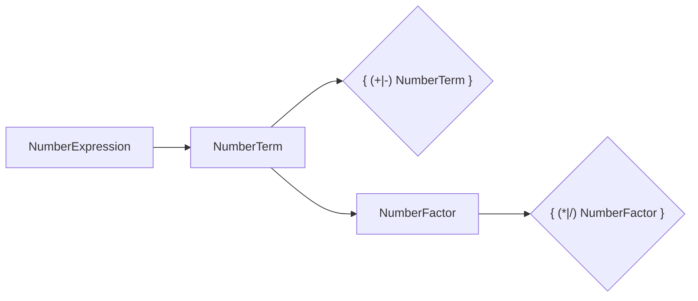

# TinyExpression P4 Railroad (Mermaid)

Source of truth:
- [UBNF draft](../ubnf/tinyexpression-p4-draft.ubnf)
- [BNF view](tinyexpression-p4-draft.bnf)

Notes:
- This file provides railroad-like diagrams in Mermaid for key rules.
- For complete rule details, use the BNF/UBNF files above.

## 1. Formula



## 2. Expression Choice



## 3. Number Expression (precedence)



## 4. Variable Declaration

```mermaid
flowchart LR
  VD[VariableDeclaration] --> NVD[NumberVariableDeclaration]
  VD --> SVD[StringVariableDeclaration]
  VD --> BVD[BooleanVariableDeclaration]
  VD --> OVD[ObjectVariableDeclaration]

  NVD --> KW[(var|variable)]
  KW --> DOLLAR[$]
  DOLLAR --> ID[IDENTIFIER]
  ID --> TH[[NumberTypeHint?]]
  TH --> ST[[NumberSetter?]]
  ST --> DESC[description=STRING]
  DESC --> SEMI[;]
```

## 5. Method Declaration + Invocation

```mermaid
flowchart LR
  MD[MethodDeclaration] --> NMD[NumberMethodDeclaration]
  MD --> SMD[StringMethodDeclaration]
  MD --> BMD[BooleanMethodDeclaration]
  MD --> OMD[ObjectMethodDeclaration]

  MI[MethodInvocation] --> CALL[call]
  CALL --> NAME[IDENTIFIER]
  NAME --> LP[(]
  LP --> ARGS[[Arguments?]]
  ARGS --> RP[)]
```

## 6. If / Match

```mermaid
flowchart LR
  IF[IfExpression] --> IFKW[if]
  IFKW --> COND[(BooleanExpression)]
  COND --> THEN[{ Expression }]
  THEN --> ELSEKW[else]
  ELSEKW --> ELSEB[{ Expression }]

  NM[NumberMatchExpression] --> MKW[match]
  MKW --> LCB[\{]
  LCB --> CASE1[NumberCase]
  CASE1 --> CASEN[NumberCase*]
  CASEN --> DEF[default -> NumberCaseValue]
  DEF --> RCB[\}]
```
