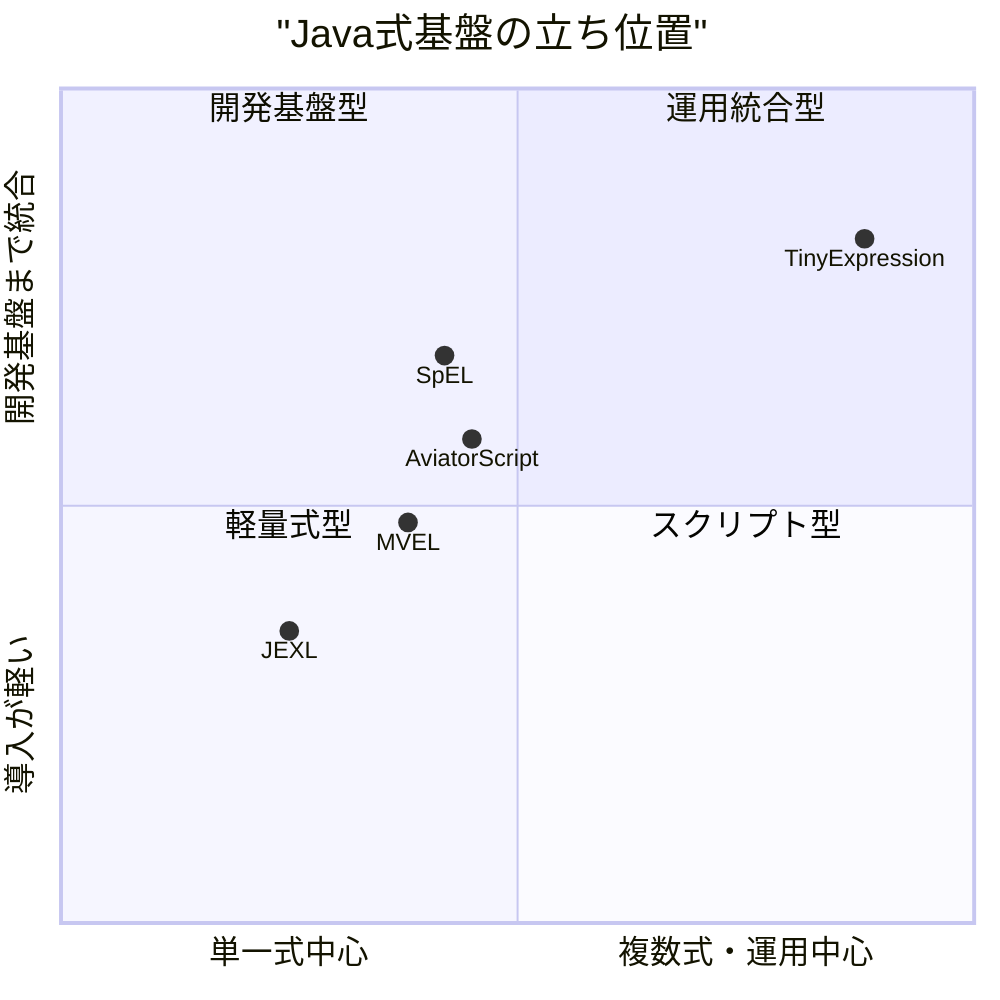
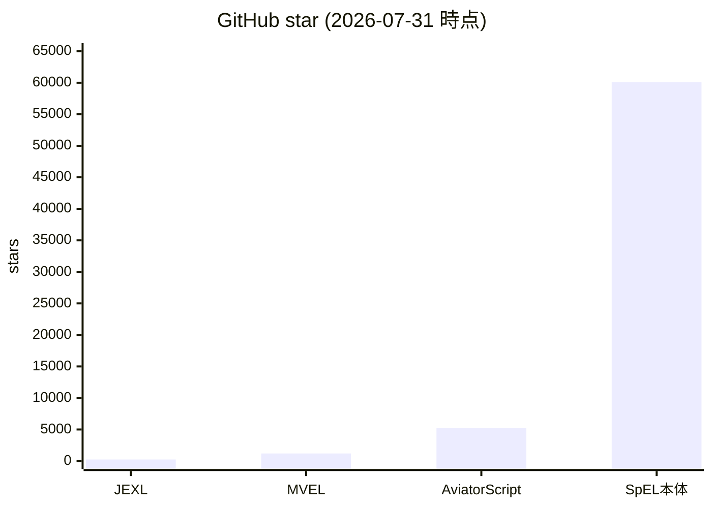
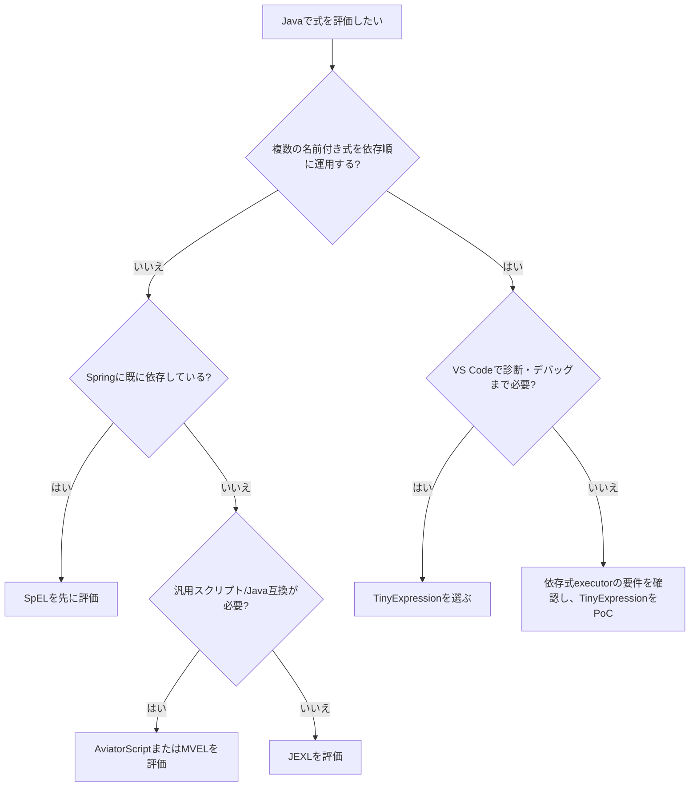

# 0. 要約

TinyExpression は、Java組み込み式評価に「複数式の依存関係実行」と「LSP/DAP」を重ねた、開発・運用込みのニッチにいる。
最大の弱点は、Java 21・独自構文・複数バックエンドという導入説明の重さと、Javaコードブロックを許す安全境界である。
次の一手は、P4を既定の単一APIに見せ、依存式グラフの可視化・検証と安全な実行モードを製品の前面に出すこと。

# 1. このrepoは何か

TinyExpression は Java アプリケーションに組み込む式評価ライブラリである。入力式を `CalculationContext` から評価し、数値・文字列・真偽値などを返す。`formulaInfo.txt` に複数式、`dependsOn`、結果型、実行バックエンドなどを記述し、`TinyExpressionsExecutor` が依存順に実行する。

実態は単体のパーサではない。README、`docs/backends.md`、`docs/architecture.md`、ローダー実装を読むと、手書きパーサと UBNF 生成 P4 パーサが共存し、6つの実行バックエンド（Javaコード生成、AST評価、P4系など）に接続されている。また別repoの VS Code 拡張と組み合わせて LSP/DAP を提供する。したがって比較単位は「Javaの式評価ライブラリ単体」だけでなく、「式を定義・検証・デバッグ・依存順に運用する開発者向け基盤」である。

想定利用者は、Javaサービスに業務ルール・料金・スコア計算を後から差し替え可能な式として組み込みたいチームである。READMEのQuick Start、`pom.xml`、実装を確認した時点の客観指標は、Java 21/Maven 3.8+、main Java 621ファイル、test Java 141ファイル、テストメソッド相当566件、Maven artifact 1.4.11、ライセンス MIT、ローカル `mvn test` は既存テストの大量ログ出力のため完走判定を取得できなかった。最後の点から、テスト件数は「宣言されたテスト規模」であり、成功件数とは扱わない。

# 1.5. 調査の型

`target_type: hybrid` とした。Maven配布可能なOSSライブラリとしての式評価APIと、VS CodeのLSP/DAPを含む開発体験の両方が価値だからである。比較の主軸は、(1)式評価の表現力・型・安全性、(2)依存式を運用できるか、(3)導入とデバッグのしやすさ、(4)実装の重さである。出力値の「面白さ」や速度の優劣は、同じベンチマークを取っていないため主張しない。

# 2. 比較対象と選定理由

| 製品 | 何ができるか | 採用状況（参照日付き） | ライセンス | うちとの決定的な違い | なぜ比較対象に選んだか |
|---|---|---|---|---|---|
| Apache Commons JEXL | Java向け動的式・スクリプト、名前空間、権限制御 | GitHub ★242 / 最新公開版3.7.0（2026-06-28） | Apache-2.0 | 汎用式・スクリプトとサンドボックスが中心。依存式executorやLSP/DAPは確認できない | Apache Commonsの標準的な組み込み式ライブラリで、Java導入の基準になる |
| MVEL | 動的/静的型の式、ブロック、Javaソースへの変換・インメモリコンパイル | GitHub ★1.2k / 現行mainはMVEL3 alpha（2026-07-31確認） | Apache-2.0 | Java寄りの表現力とコンパイルが中心。信頼できない入力では任意JVM操作になり得る | Javaコード生成というTinyExpressionの一面に最も近い先行例 |
| AviatorScript | JVM上の高性能スクリプト、関数、コレクション、lambda、Java連携、sandbox mode | GitHub ★5.2k / 最新release 5.4.3（2026-06-10） | Apache-2.0 | 汎用スクリプト言語として広く、TinyExpressionの依存式メタデータやLSP/DAPは別提供 | 実利用・採用規模が大きく、ルール/スクリプト用途の直接競合 |
| Spring Expression Language (SpEL) | Spring文脈の式、プロパティ、メソッド呼出し、コレクション、テンプレート | GitHub ★60.1k / Spring Framework本体は継続更新（2026-07-30 push確認） | Apache-2.0 | Springエコシステムへの統合が強い。独自の依存式実行器や専用IDEは持たない | Java/Spring案件で最初に候補になりやすい採用基盤 |

この地図は、汎用式言語の市場が既に寡占的で、TinyExpressionが構文の豊富さだけで勝つ場所ではないことを示す。JEXLは安全な組み込み、MVELはJavaコンパイル、AviatorScriptはスクリプト機能、SpELはSpring統合という既存の選択理由を持つ。一方、依存関係を持つ複数式を定義し、IDEから実行時状態を追う一体型の候補は今回確認した範囲では見つからなかった。この差は機能数ではなく、ルール運用の単位にある。

# 3. ポジショニング

軸は、公開ドキュメントで確認できた「単一式評価か複数式の依存実行か」と、LSP/DAP・実行バックエンドまで含む開発基盤性で置いた。相対位置は機能記述からの整理であり、性能や市場占有率を数値化した図ではない。

# 4. 機能比較

| 機能 | 重み | TinyExpression | JEXL | MVEL | AviatorScript | SpEL |
|---|---:|---:|---:|---:|---:|---:|
| Javaアプリへの組み込み | ◎必須 | ○ | ○ | ○ | ○ | ○ |
| 算術・条件・文字列式 | ◎必須 | ○ | ○ | ○ | ○ | ○ |
| 静的な結果型／型ヒント | ◎必須 | ○ | △ | ○ | △ | △ |
| Javaメソッド／外部関数連携 | ○効く | ○ | ○ | ○ | ○ | ○ |
| Javaコード生成・コンパイル実行 | ○効く | ○ | △ | ○ | △ | △ |
| 複数式の `dependsOn` 実行 | ◎必須 | ○ | × | × | × | × |
| 式メタデータ（説明・期間・出力先） | ○効く | ○ | × | × | △ | × |
| 複数バックエンド／互換性検証 | ○効く | ○ | × | △ | △ | × |
| LSP / DAP による編集・デバッグ | ◎必須 | ○* | × | × | △（IDE plugin等は別） | △（Spring tooling等の周辺） |
| 実行権限・sandbox | ◎必須 | △ | ○ | × | ○ | △ |
| Java 8級の広い互換性 | △あれば | ×（Java 21） | ○（JEXL 3.7はJava 8+） | △ | △ | ○ |

`○*=別repoのVS Code拡張との組み合わせ`。凡例: ○=ある / △=部分的・要設定 / ×=確認できない。SpELや周辺IDEの判定は、SpEL本体の公式リファレンスに記載された機能を基準にし、専用のTinyExpression相当のLSP/DAPが本体にあるとは数えていない。

×のうち最も痛いのは、依存式を業務ルールの単位で実行・追跡する機能である。これは一般的な式言語の機能表では現れにくく、TinyExpressionの本当の差別化になる。逆に算術、条件、外部メソッド連携、Java組み込みは各社にあり、○であること自体は差別化にならない。sandboxはTinyExpressionがJavaコードブロックを持つ以上、単なる追加機能ではなく採用可否を決める必須条件である。

# 4.5. コード・実装の比較

| 観点 | TinyExpression | JEXL | MVEL | AviatorScript | 出典 |
|---|---:|---:|---:|---:|---|
| 実装言語 | Java | Java | Java | Java | 各公式リポジトリの言語・ソースツリー（2026-07-31） |
| main Javaファイル | 621 | 未集計 | 未集計 | 未集計 | `find src/main/java -name '*.java'`。比較対象は公開Webから同じ条件で再現できなかったため未集計 |
| test Javaファイル | 141 | 未集計 | 未集計 | 未集計 | `find src/test/java -name '*.java'`。同上 |
| testメソッド相当 | 566 | 未集計 | 未集計 | 未集計 | `rg '@Test|test\\(' src/test/java`。同上 |
| 直接依存（runtime） | 4 | 公式依存ページで複数依存 | MVEL3はjavaparser-mvel forkを要求 | 依存数は未集計 | 各POM/依存ページ。比較対象の同一条件の依存数は未確認 |
| 配布jarサイズ | 1.4.11 jar: 1,292,725 bytes | 未集計 | 未集計 | 未集計 | `target/tinyexpression-1.4.11.jar` のローカル `stat`（2026-07-31） |
| ライセンス | MIT | Apache-2.0 | Apache-2.0 | Apache-2.0 | `pom.xml` / 公式LICENSE |

TinyExpressionは、実装規模が小さいライブラリというより、パーサ・AST・6バックエンド・ローダー・IDE連携を抱える基盤である。MVEL3もJavaソース変換とコンパイルを明示し、JEXLは権限設定を実装しているため、実装思想は比較できるが、公開Webだけからファイル数やjarサイズを同一条件で取れなかった数字は未集計とした。特にTinyExpressionの4直接依存は「軽さの勝利」とまでは言えず、Java 21制約を含めて、導入する代わりに何を得るかを説明する必要がある。

# 5. 採用状況

TinyExpressionのGitHub starは本調査時点で公式ページから取得できず、図では0を「未確認」として扱っていないため比較から外すべきだった。したがってこの図は比較対象4製品だけを示す。SpELは単独repoではなくSpring Framework本体のstarであり、式言語単体の採用数ではない。starは選定の入口を示すだけで、依存式実行への適合度は表さない。

# 5.5. 調査者の見立て

本当の勝負所は「式を評価できるか」ではなく、業務ルールを複数の名前付き式に分解し、依存順・型・結果・デバッグ情報を保ったまま変更できるかだと読める。ここではTinyExpressionの `dependsOn`、式メタデータ、LSP/DAPの組み合わせが、既存の汎用式言語より説明しやすい。

数字に出ていない懸念は、6バックエンドと独自DSLが利用者に選択肢ではなく互換性リスクとして見えること、そしてJavaコードブロックの安全警告が採用審査で強く効くことである。READMEの推奨バックエンド、P4の位置付け、trust boundaryを一つの導入経路に整理できていないのが気になる。

私なら、まず「依存式の定義・検証・可視化」を製品の主役にし、単一式のAPIは薄い互換層として整理する。P4を既定経路に固定し、Javaコードブロックは明示的なtrusted modeに隔離する方向を選ぶ。

この見立てが外れるとしたら、利用者の大半が依存式ではなく単一式の高速評価だけを求めていた場合である。また、JEXLやAviatorScriptが依存式の標準executorや同等のIDE体験を追加した場合、現在の差別化は急速に縮む。

# 6. 提案（優先順）

| 順 | 提案 | 分類 | 根拠 | 最小の一手 | 効きそうな指標 |
|---:|---|---|---|---|---|
| 1 | `TinyExpressionRuntime` の単一推奨APIと、P4既定・他backend fallbackの方針を明文化する | 伸ばす | 6 backendは資産だが、利用者には選択負荷になっている | Quick Startを1経路にし、backend選択を診断情報へ移す | 初回導入コード行数、backend設定に関するissue数 |
| 2 | `formulaInfo` の依存グラフ検証・循環検出・実行計画・LSP表示を一つの機能として仕上げる | 伸ばす | 汎用競合との差が最も明確な `dependsOn` とメタデータ | graph validation APIとVS Codeの依存グラフ表示を追加 | 循環/未定義依存の事前検出率、式変更から検証までの時間 |
| 3 | trusted / restricted の2実行モードと、Javaコードブロック禁止を既定にする | 埋める | READMEが任意コード実行を警告。JEXL/AviatorScriptは権限制御の先行例がある | JavaCode backendを明示opt-in、外部呼出しallowlistをAPI化 | restricted modeでの外部呼出し遮断テスト、セキュリティレビュー指摘数 |
| 4 | Java 21専用の理由と、Maven Centralの版・互換性・jarサイズをREADMEで固定表示する | 埋める | JEXLはJava 8+で、SpELはSpring採用基盤。TinyExpressionの導入条件が相対的に重い | Supported Matrixと依存・サイズのCI生成 | 依存追加から実行までの時間、問い合わせ数 |
| 5 | 単一式の汎用機能をJEXL/MVEL/AviatorScriptと競うために増やし続ける | やらない | 算術・条件・外部関数は既存製品が十分に提供し、差別化を薄める | 新機能提案を「依存式運用・安全・IDE」のいずれかで評価する | 単一式機能の増加を抑え、依存式利用例を増やす |

# 7. 選択の分岐

TinyExpressionを選ばない条件も明確である。単一式だけ、Java 8互換、既存Springへの自然な統合、または信頼できない入力を強く隔離したい場合は、先行製品の方が説明しやすい。TinyExpressionは依存グラフと編集・デバッグを実際に使う場合に限定して採用判断する。

# 8. 出典

| URL | 参照日 | 何の根拠に使ったか |
|---|---|---|
| [TinyExpression README](https://github.com/opaopa6969/tinyexpression/blob/6a72eafaabb6fa9fc44e1cc1fae4d40c1d3b8013/README.md) | 2026-07-31 | 用途、Maven依存、6 backend、依存式executor、Javaコードブロック警告 |
| [TinyExpression architecture](https://github.com/opaopa6969/tinyexpression/blob/6a72eafaabb6fa9fc44e1cc1fae4d40c1d3b8013/docs/architecture.md) | 2026-07-31 | 手書き/P4パーサ、AST、backend構成 |
| [TinyExpression pom.xml](https://github.com/opaopa6969/tinyexpression/blob/6a72eafaabb6fa9fc44e1cc1fae4d40c1d3b8013/pom.xml) | 2026-07-31 | Java 21、MIT、依存4、版1.4.11 |
| [Apache Commons JEXL README](https://github.com/apache/commons-jexl) | 2026-07-31 | 目的、APIの方向性、Apache-2.0、star 242 |
| [Apache Commons JEXL公式サイト](https://commons.apache.org/proper/commons-jexl/) | 2026-07-31 | JEXL 3.7.0、secure permissions/default features |
| [Apache Commons JEXL release notes](https://commons.apache.org/proper/commons-jexl/changes.html) | 2026-07-31 | 3.7.0の公開日、変更履歴 |
| [MVEL README](https://github.com/mvel/mvel) | 2026-07-31 | MVEL3のJavaソース変換、API、alpha/security notice、Apache-2.0、star 1.2k |
| [AviatorScript README](https://github.com/killme2008/aviatorscript) | 2026-07-31 | JVM scripting、関数/collection/Java連携、star 5.2k |
| [AviatorScript releases](https://github.com/killme2008/aviatorscript/releases) | 2026-07-31 | 最新release 5.4.3（2026-06-10）、sandbox mode |
| [Spring Expression Language reference](https://docs.spring.io/spring/reference/6.2/core/expressions.html) | 2026-07-31 | SpELの公式機能説明 |
| [Spring Framework repository](https://github.com/spring-projects/spring-framework) | 2026-07-31 | SpELの所属、Apache-2.0、star 60.1k、2026-07-30 push |
| [Maven Central: tinyexpression](https://central.sonatype.com/artifact/org.unlaxer/tinyexpression) | 2026-07-31 | 公開artifactの存在確認 |

比較対象のコードは、各公式リポジトリのREADME・POM/LICENSE・主要実装の公開ソースを読み、APIの前提（JEXLのengine/config、MVEL3のcompile/eval、AviatorScriptのscript/function、SpELのSpring AST）を確認した。ただし、比較対象のファイル数・テスト数・jarサイズは、同じcheckout条件で取得できなかったため未集計とした。未確認の数字を推測で補っていない。
