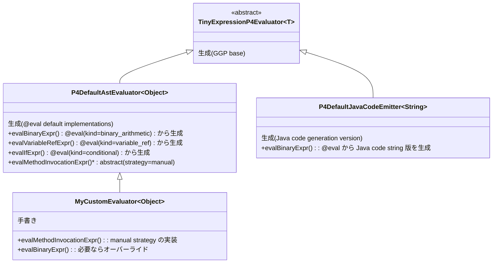

[English](./parser-generator-comparison-and-eval-strategy.en.md) | [日本語](./parser-generator-comparison-and-eval-strategy.ja.md) | [Index](./INDEX.md)

---

# Parser Generator 比較 & @eval Strategy 設計

## 1. unlaxer-parser vs 世の Parser Generator

### 比較表

| 観点 | ANTLR | PEG.js / pest | Tree-sitter | **unlaxer (P4 UBNF)** |
|------|-------|---------------|-------------|----------------------|
| **文法記法** | EBNF風 | PEG | JS-like DSL | UBNF (EBNF拡張) |
| **パース方式** | LL(*), ALL(*) | PEG (ordered choice) | GLR | PEG (ordered choice) |
| **型付きAST生成** | Visitor/Listener (汎用) | なし | S-expression | **sealed interface records** |
| **LSP生成** | 手書き必要 | なし | 組み込み | **自動生成** |
| **DAP生成** | なし | なし | なし | **自動生成** |
| **Evaluator生成** | なし | なし | なし | **GGP skeleton生成** |
| **Java code emitter** | なし | なし | なし | **生成可能** |
| **Mapper生成** | なし (手書きVisitor) | なし | なし | **自動生成** |
| **エコシステム** | 巨大 | 中 | 大 | 小 |
| **ドキュメント** | 豊富 | 中 | 豊富 | 少ない |
| **言語サポート** | Java,C#,Python,JS等 | JS | C, many bindings | **Java専用** |

### unlaxer 独自の利点

1. **文法からLSP/DAPまで一気通貫** — ANTLRでLSPを作るには手書きで数千行必要
2. **sealed interface + records のAST** — Java 21の型安全性をフル活用。ANTLRのParseTreeはuntyped
3. **GGP (Generation Gap Pattern)** — 生成コードと手書きコードの分離が設計レベルで組み込み
4. **`@mapping` アノテーション** — 文法内にAST構造を宣言的に定義。ANTLRでは別ファイルにVisitorを書く
5. **`@eval` 拡張の可能性** — 評価戦略まで文法に書けるのはユニーク

### 正直な欠点

1. **エコシステムが小さい** — ANTLRは何百万ユーザー
2. **ドキュメントが限定的** — specs/ にはあるが、チュートリアルやQ&Aがない
3. **Java専用** — 他言語への展開がない（JVM言語なら使える）
4. **エラー回復が弱い** — PEGベースなのでパース失敗時の診断メッセージが不十分
5. **MapperGenerator のバグ可能性** — 複雑な文法で未発見のバグがありうる

### 総合評価

unlaxer-parser は「DSL開発のための統合開発環境」。ANTLRが「パーサー生成器」なのに対して、
unlaxerは文法定義からパーサー・AST・マッパー・評価器・LSP・DAPまで全部生成する。
`@eval` 拡張を入れれば「文法を書くだけで動く言語処理系が手に入る」世界になる。

---

## 2. @eval Strategy 設計

### 概要

`@eval` アノテーションを UBNF 文法に追加し、EvaluatorGenerator が具象実装を自動生成する。
Strategy パラメータで生成方式を選択可能。

### Strategy 一覧

| Strategy | 説明 | ユースケース |
|----------|------|-------------|
| `default` | ジェネレータ組み込みの標準実装 | 大多数のケース |
| `template("file.java.tmpl")` | 外部テンプレートファイルから展開 | BigDecimal特殊処理、ログ挿入、パフォーマンスカウンタ等 |
| `manual` | abstract のまま（人間が書く） | 完全カスタム実装が必要なケース |

### UBNF 構文例

```ubnf
// Strategy: default — ジェネレータが標準実装を生成
@mapping(BinaryExpr, params=[left, op, right])
@leftAssoc
@precedence(level=10)
@eval(kind=binary_arithmetic, strategy=default)
NumberExpression ::= NumberTerm @left { AddOp @op NumberTerm @right } ;

// Strategy: template — 外部テンプレートから生成
@mapping(BinaryExpr, params=[left, op, right])
@leftAssoc
@precedence(level=20)
@eval(kind=binary_arithmetic, strategy=template("custom-term-eval.java.tmpl"))
NumberTerm ::= NumberFactor @left { MulOp @op NumberFactor @right } ;

// Strategy: manual — abstract のまま残す
@mapping(MethodInvocationExpr, params=[name])
@eval(kind=invocation, strategy=manual)
MethodInvocation ::= MethodInvocationHeader IDENTIFIER @name '(' [ Arguments ] ')' ;

// デフォルト動作の例
@mapping(VariableRefExpr, params=[name])
@eval(kind=variable_ref, strip_prefix="$")
VariableRef ::= '$' IDENTIFIER @name ;

@mapping(IfExpr, params=[condition, thenExpr, elseExpr])
@eval(kind=conditional)
IfExpression ::= 'if' '(' BooleanExpression @condition ')' '{' Expression @thenExpr '}' 'else' '{' Expression @elseExpr '}' ;
```

### @eval kind 一覧

| kind | 説明 | 生成されるコード |
|------|------|-----------------|
| `binary_arithmetic` | 左結合の二項演算 | leaf判定 + 再帰評価 + applyBinary |
| `variable_ref` | 変数参照 | strip prefix + context.getXxx() |
| `conditional` | if/else 分岐 | condition評価 + branch選択 |
| `match_case` | パターンマッチ | case順評価 + default |
| `literal` | リテラル値 | parseNumber/Boolean/String |
| `comparison` | 比較演算 | left/right評価 + compareTo |
| `invocation` | メソッド呼び出し | (通常manual) |
| `passthrough` | 値をそのまま返す | eval(node.value()) |

### テンプレート変数

テンプレートファイル (`.java.tmpl`) 内で使える変数:

```
{{left}}        — 左オペランドのeval結果を取得する式
{{right}}       — 右オペランドのeval結果を取得する式 (リストの場合 {{right[i]}})
{{op}}          — 演算子文字列 (リストの場合 {{op[i]}})
{{node}}        — 現在のASTノード参照
{{resultType}}  — 結果の型 (ExpressionType)
{{numberType}}  — 数値の型 (ExpressionType)
{{context}}     — CalculationContext参照
{{eval(expr)}}  — 任意のAST式を再帰評価する呼び出し
```

### 生成されるクラス構造



---
[← Previous: Implementation Guide](./implementation-guide-dialogue.ja.md) | [Index](./INDEX.md)
