# Railroad Diagrams

Auto-generated from: `../tinyexpression/docs/ubnf/tinyexpression-p4-complete.ubnf`

## Table of Contents

### TinyExpressionP4

- [Formula](#formula)
- [CodeBlock](#codeblock)
- [ImportDeclaration](#importdeclaration)
- [ImportDeclarationWithMethod](#importdeclarationwithmethod)
- [ImportDeclarationBare](#importdeclarationbare)
- [ClassName](#classname)
- [VariableDeclaration](#variabledeclaration)
- [NumberVariableDeclaration](#numbervariabledeclaration)
- [StringVariableDeclaration](#stringvariabledeclaration)
- [BooleanVariableDeclaration](#booleanvariabledeclaration)
- [ObjectVariableDeclaration](#objectvariabledeclaration)
- [TypeHint](#typehint)
- [NumberTypeHint](#numbertypehint)
- [StringTypeHint](#stringtypehint)
- [BooleanTypeHint](#booleantypehint)
- [ObjectTypeHint](#objecttypehint)
- [NumberSetter](#numbersetter)
- [StringSetter](#stringsetter)
- [BooleanSetter](#booleansetter)
- [ObjectSetter](#objectsetter)
- [Description](#description)
- [Annotation](#annotation)
- [AnnotationParameters](#annotationparameters)
- [AnnotationParameter](#annotationparameter)
- [MethodDeclaration](#methoddeclaration)
- [NumberMethodDeclaration](#numbermethoddeclaration)
- [StringMethodDeclaration](#stringmethoddeclaration)
- [BooleanMethodDeclaration](#booleanmethoddeclaration)
- [ObjectMethodDeclaration](#objectmethoddeclaration)
- [MethodParameters](#methodparameters)
- [MethodParameter](#methodparameter)
- [NumberReturnType](#numberreturntype)
- [StringReturnType](#stringreturntype)
- [BooleanReturnType](#booleanreturntype)
- [ObjectReturnType](#objectreturntype)
- [ReturnType](#returntype)
- [ExternalBooleanInvocation](#externalbooleaninvocation)
- [ExternalNumberInvocation](#externalnumberinvocation)
- [ExternalStringInvocation](#externalstringinvocation)
- [ExternalObjectInvocation](#externalobjectinvocation)
- [SideEffectHeader](#sideeffectheader)
- [SideEffectNumberExpression](#sideeffectnumberexpression)
- [SideEffectStringExpression](#sideeffectstringexpression)
- [SideEffectBooleanExpression](#sideeffectbooleanexpression)
- [QualifiedMethod](#qualifiedmethod)
- [MethodInvocationHeader](#methodinvocationheader)
- [MethodInvocation](#methodinvocation)
- [Arguments](#arguments)
- [NumberExpression](#numberexpression)
- [NumberTerm](#numberterm)
- [AddOp](#addop)
- [MulOp](#mulop)
- [NumberFactor](#numberfactor)
- [TernaryExpression](#ternaryexpression)
- [MathFunction](#mathfunction)
- [SinFunction](#sinfunction)
- [CosFunction](#cosfunction)
- [TanFunction](#tanfunction)
- [SqrtFunction](#sqrtfunction)
- [MinFunction](#minfunction)
- [MaxFunction](#maxfunction)
- [RandomFunction](#randomfunction)
- [ToNumFunction](#tonumfunction)
- [StringExpression](#stringexpression)
- [StringTerm](#stringterm)
- [StringMethodCall](#stringmethodcall)
- [ToUpperCaseMethod](#touppercasemethod)
- [ToLowerCaseMethod](#tolowercasemethod)
- [TrimMethod](#trimmethod)
- [Slice](#slice)
- [BooleanExpression](#booleanexpression)
- [BooleanAndExpression](#booleanandexpression)
- [BooleanXorExpression](#booleanxorexpression)
- [BooleanFactor](#booleanfactor)
- [NotExpression](#notexpression)
- [StringComparisonExpression](#stringcomparisonexpression)
- [EqualityOp](#equalityop)
- [ComparisonExpression](#comparisonexpression)
- [CompareOp](#compareop)
- [IsPresentFunction](#ispresentfunction)
- [InTimeRangeFunction](#intimerangefunction)
- [InDayTimeRangeFunction](#indaytimerangefunction)
- [DayOfWeek](#dayofweek)
- [StringPredicateMethod](#stringpredicatemethod)
- [IndexOfMethod](#indexofmethod)
- [StartsWithMethod](#startswithmethod)
- [EndsWithMethod](#endswithmethod)
- [ContainsMethod](#containsmethod)
- [InMethod](#inmethod)
- [CommaSeparatedStrings](#commaseparatedstrings)
- [ObjectExpression](#objectexpression)
- [IfExpression](#ifexpression)
- [NumberMatchExpression](#numbermatchexpression)
- [NumberCase](#numbercase)
- [NumberDefaultCase](#numberdefaultcase)
- [NumberCaseValue](#numbercasevalue)
- [StringMatchExpression](#stringmatchexpression)
- [StringCase](#stringcase)
- [StringDefaultCase](#stringdefaultcase)
- [StringCaseValue](#stringcasevalue)
- [BooleanMatchExpression](#booleanmatchexpression)
- [BooleanCase](#booleancase)
- [BooleanDefaultCase](#booleandefaultcase)
- [BooleanCaseValue](#booleancasevalue)
- [VariableRef](#variableref)
- [Expression](#expression)

## TinyExpressionP4

### Formula

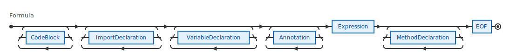

### CodeBlock

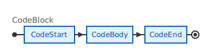

### ImportDeclaration

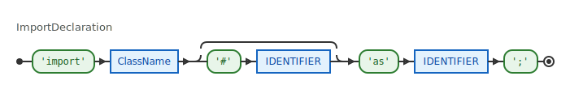

### ImportDeclarationWithMethod

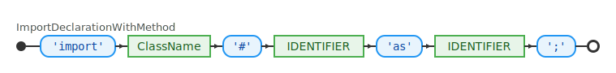

### ImportDeclarationBare

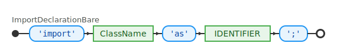

### ClassName

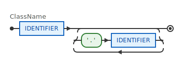

### VariableDeclaration

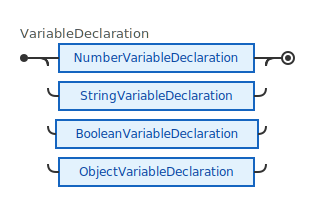

### NumberVariableDeclaration

### StringVariableDeclaration

### BooleanVariableDeclaration

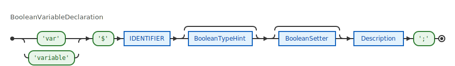

### ObjectVariableDeclaration

### TypeHint

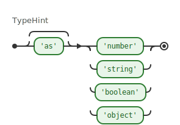

### NumberTypeHint

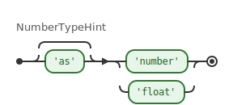

### StringTypeHint

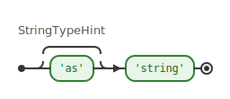

### BooleanTypeHint

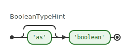

### ObjectTypeHint

### NumberSetter

### StringSetter

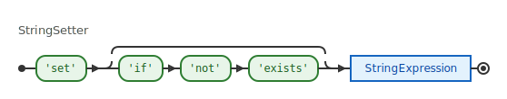

### BooleanSetter

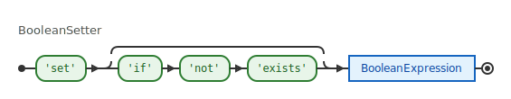

### ObjectSetter

### Description

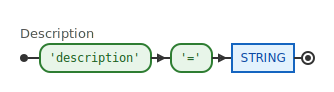

### Annotation

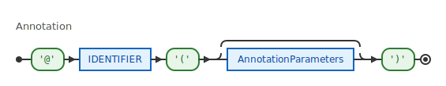

### AnnotationParameters

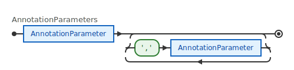

### AnnotationParameter

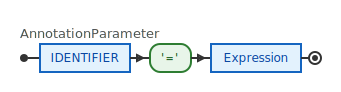

### MethodDeclaration

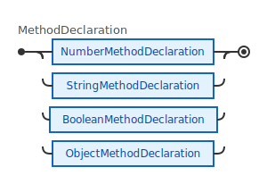

### NumberMethodDeclaration

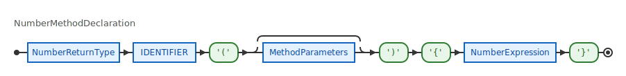

### StringMethodDeclaration

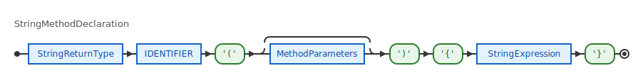

### BooleanMethodDeclaration

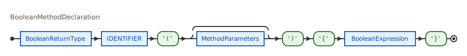

### ObjectMethodDeclaration

### MethodParameters

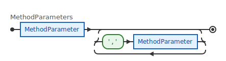

### MethodParameter

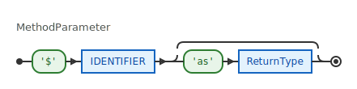

### NumberReturnType

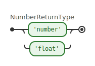

### StringReturnType

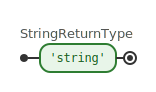

### BooleanReturnType

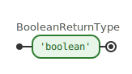

### ObjectReturnType

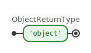

### ReturnType

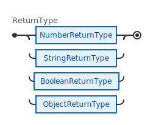

### ExternalBooleanInvocation

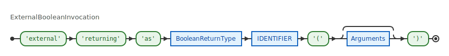

### ExternalNumberInvocation

### ExternalStringInvocation

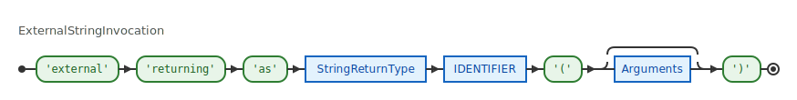

### ExternalObjectInvocation

### SideEffectHeader

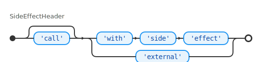

### SideEffectNumberExpression

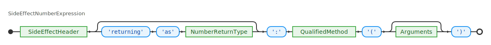

### SideEffectStringExpression

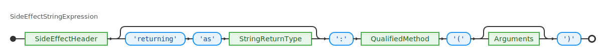

### SideEffectBooleanExpression

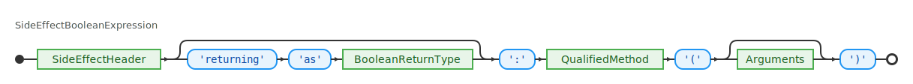

### QualifiedMethod

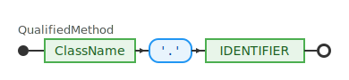

### MethodInvocationHeader

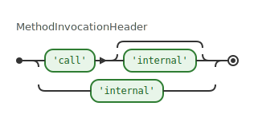

### MethodInvocation

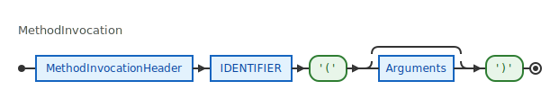

### Arguments

### NumberExpression

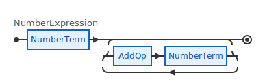

### NumberTerm

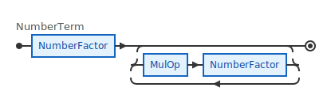

### AddOp

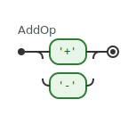

### MulOp

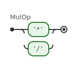

### NumberFactor

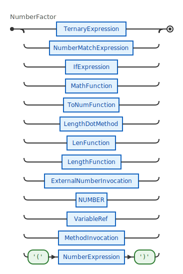

### TernaryExpression

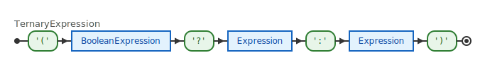

### MathFunction

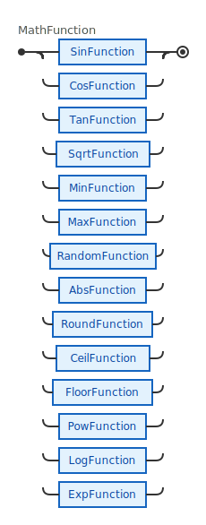

### SinFunction

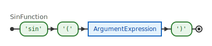

### CosFunction

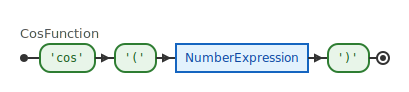

### TanFunction

### SqrtFunction

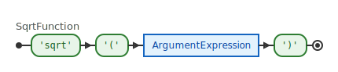

### MinFunction

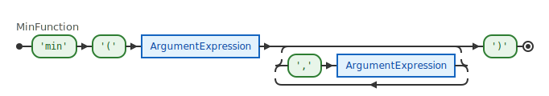

### MaxFunction

### RandomFunction

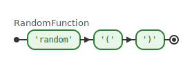

### ToNumFunction

### StringExpression

### StringTerm

### StringMethodCall

### ToUpperCaseMethod

### ToLowerCaseMethod

### TrimMethod

### Slice

### BooleanExpression

### BooleanAndExpression

### BooleanXorExpression

### BooleanFactor

### NotExpression

### StringComparisonExpression

### EqualityOp

### ComparisonExpression

### CompareOp

### IsPresentFunction

### InTimeRangeFunction

### InDayTimeRangeFunction

### DayOfWeek

### StringPredicateMethod

### IndexOfMethod

### StartsWithMethod

### EndsWithMethod

### ContainsMethod

### InMethod

### CommaSeparatedStrings

### ObjectExpression

### IfExpression

### NumberMatchExpression

### NumberCase

### NumberDefaultCase

### NumberCaseValue

### StringMatchExpression

### StringCase

### StringDefaultCase

### StringCaseValue

### BooleanMatchExpression

### BooleanCase

### BooleanDefaultCase

### BooleanCaseValue

### VariableRef

### Expression

