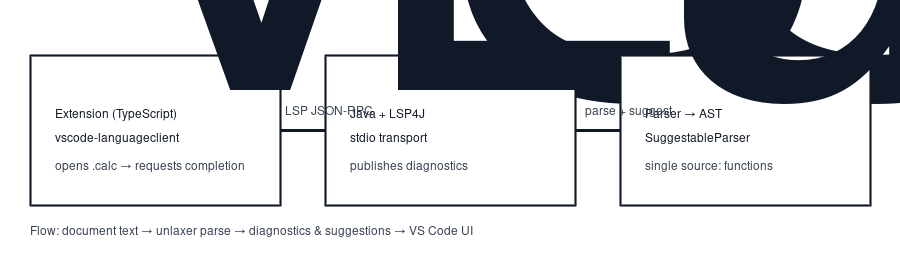

# TinyExpression DSL (LSP) - VS Code Extension

This is a minimal VS Code extension that launches a Java LSP server (LSP4J) via stdio.

## What is included
- VS Code client (TypeScript) using `vscode-languageclient`
- Minimal syntax highlighting for `.tinyexp`
- A Maven module (`server/`) that builds a runnable jar for the LSP server
- A helper script that copies the built jar into `server-dist/`

## Quick start (dev)
1. Install prerequisites:
   - Node.js (LTS)
   - Java 21+
   - Maven

2. Install extension dependencies:
   ```bash
   npm install
   ```

3. Build the language server jar and copy it into the extension:
   ```bash
   npm run build:server
   ```

4. In VS Code, press `F5` to start the Extension Development Host.

5. Create a file `demo.tinyexp` and type expressions like:
   ```
   1 + 2 * (3 + 4)
   ```

## Packaging to .vsix
```bash
npm run package
```

Recommended (reproducible script, builds server + compile + package):
```bash
npm run package:vsix
```

Optional flags:
```bash
# package without rebuilding server jar
bash scripts/package-vsix.sh --skip-server

# custom output directory
bash scripts/package-vsix.sh --out-dir ./dist

# also create token/ast/dsl-javacode distribution variants
bash scripts/package-vsix.sh --matrix-three
```

## Catalog setup in VS Code (TE022/TE024)
1. Open VS Code Settings.
2. Search `TinyExpression LSP: Catalog Path`.
3. Set one or more catalog files:
   - `${workspaceFolder}/catalog/nimt.tecatalog`
   - `${workspaceFolder}/catalog/fa.tecatalog`
   - Multiple files can be joined with `,`.
4. Reopen `.tinyexp` files (or run `Developer: Reload Window`).

See details:
- [docs/PLUGIN-USAGE.md](docs/PLUGIN-USAGE.md)
- [docs/CATALOG-PROVIDER-EXTENSION.md](docs/CATALOG-PROVIDER-EXTENSION.md)

## Configuration
- `tinyExpressionLsp.server.javaPath`: path to java executable (default: `java`)
- `tinyExpressionLsp.server.jarPath`: optional path to an external server jar. If empty, uses the bundled jar in this extension.
- `tinyExpressionLsp.server.jvmArgs`: extra JVM args (e.g. `-Xmx512m`)
- `tinyExpressionLsp.runtimeMode`: runtime mode hint (`token` / `ast` / `dsl-javacode`)
- `tinyExpressionLsp.catalog.path`: external variable catalog path(s) for TE024 partialKey checks (comma-separated). The extension forwards this as `-Dtinyexpression.catalog.path=...` to the server.
  - supports `${workspaceFolder}` and `~` expansion on the client side.
  - when configured, analyzer also enables catalog-backed TE022 undefined-variable diagnostics/suggestions.
- `tinyExpressionLsp.catalog.providerClass`: optional runtime provider class (`org.unlaxer.calculator.RuntimeCatalogProvider`).
- `tinyExpressionLsp.fileExtensions`: file extensions watched by the extension (default: `.tinyexp`)

### TE024 catalog format (external file)
Supported formats:
- legacy format (existing teammate format): `name|type|api|description` with partial key as `prefix_*`
- canonical format (v1):
  - marker line: `tinyexpression-catalog-v1` (optional but recommended)
  - `exact|name`
  - `prefixWithSuffix|prefix|_|1`

Example:
```text
# tinyexpression canonical catalog
tinyexpression-catalog-v1
exact|age
prefixWithSuffix|kind|_|1
```

Convert legacy to canonical:
```bash
npm run catalog:convert -- /path/nimt-allowed-variables-cfvar.txt > /tmp/nimt.tecatalog
```

Server-side direct launch also supports:
- JVM property: `-Dtinyexpression.catalog.path=/path/a.tecatalog,/path/b.txt`
- env var: `TINYEXPRESSION_CATALOG_PATH=/path/a.tecatalog,/path/b.txt`
- custom provider class:
  - JVM property: `-Dtinyexpression.catalog.provider.class=your.package.YourRuntimeCatalogProvider`
  - env var: `TINYEXPRESSION_CATALOG_PROVIDER_CLASS=your.package.YourRuntimeCatalogProvider`
  - class must implement `org.unlaxer.calculator.RuntimeCatalogProvider`

Built-in sample provider:
- class: `org.unlaxer.calculator.SampleInMemoryRuntimeCatalogProvider`
- options:
  - `-Dtinyexpression.catalog.sample.exactNames=age,score`
  - `-Dtinyexpression.catalog.sample.partialPrefixes=kind,segment`
  - `-Dtinyexpression.catalog.sample.fallbackPaths=/path/a.tecatalog,/path/b.txt`

## Troubleshooting startup
- Open command: `TinyExpression LSP: Show Server Output`
- Verify Java:
  - `tinyExpressionLsp.server.javaPath`
  - Java 21+ (`java -version`)
- Typical symptoms when startup fails:
  - `Pending response rejected since connection got disposed`
  - `Client is not running and can't be stopped ... startFailed`

## File extension policy
- recommended canonical extension: `.tinyexp`

## Notes for WSL / Windows
- If you develop in WSL but run VS Code on Windows, prefer launching the server jar with a Windows-side Java, or set `tinyExpressionLsp.server.jarPath` to a jar reachable from Windows.


## Architecture (one picture)


## Quick try (no build of the server required for users)
If you already have the `.vsix`, install it via:
- Extensions view → `...` → **Install from VSIX...**

Then open a `.tinyexp` file. The extension will launch the bundled server jar via stdio.

## Development workflow
```bash
npm install
npm run build:server
npm run compile
# VS Code: Run and Debug → "Run Extension" (F5)
```

## Plugin usage guide
Detailed usage and integration guide:
- [docs/PLUGIN-USAGE.md](docs/PLUGIN-USAGE.md)
- [docs/CATALOG-PROVIDER-EXTENSION.md](docs/CATALOG-PROVIDER-EXTENSION.md)

## Adding a new function (one place)
Functions are defined in their own parsers in `server/src/main/java/.../CalculatorParsers.java`:

```java
public static class SineFunctionParser extends WordParser implements FunctionSuggestable {
    public SineFunctionParser() {
        super("sin");
    }

    @Override
    public FunctionCompletion getFunctionCompletion() {
        return new FunctionCompletion("sin", "Sine function", "sin($1)");
    }
}
```

Register the parser class in `getFunctionParserClasses()`. That drives:
- Grammar (`FunctionNameParser`)
- Completion (`SuggestableParser`)
- Documentation

## Diagnostics: show expected tokens
When parsing fails, the server publishes diagnostics. If unlaxer provides “expected tokens” metadata, the server adds it to the diagnostic message (best-effort extraction).
